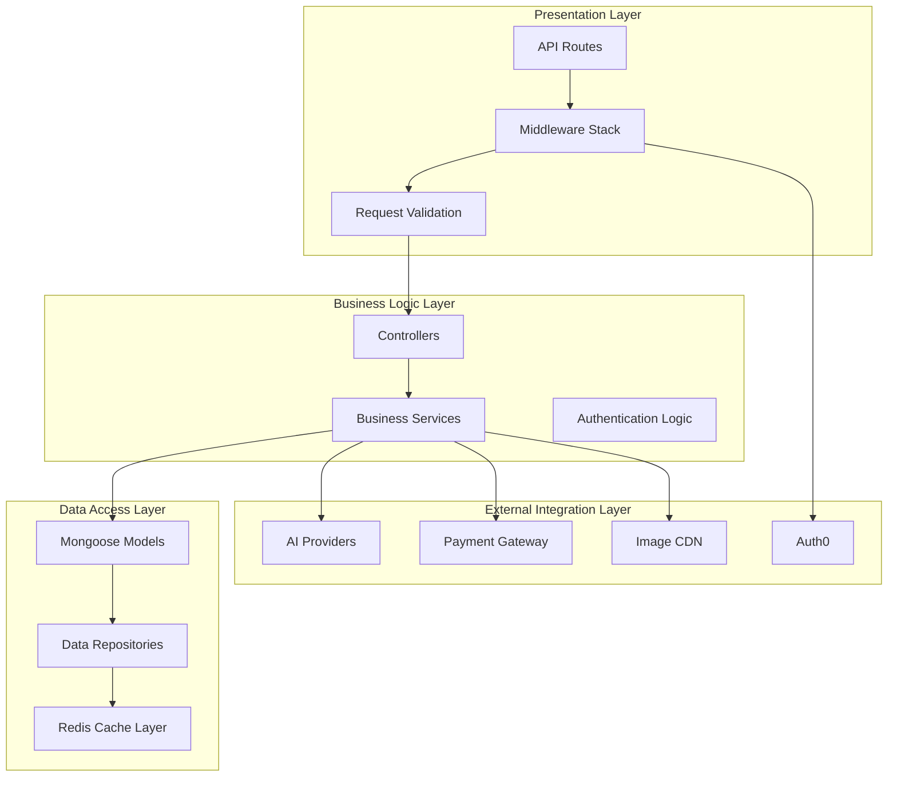
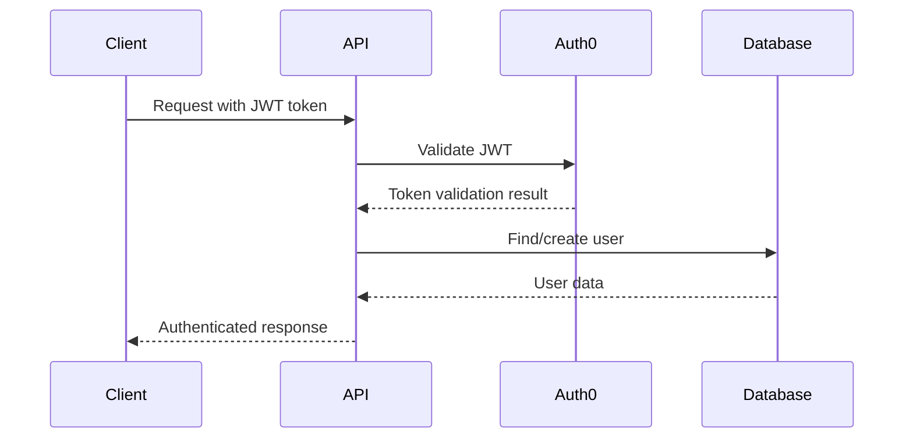
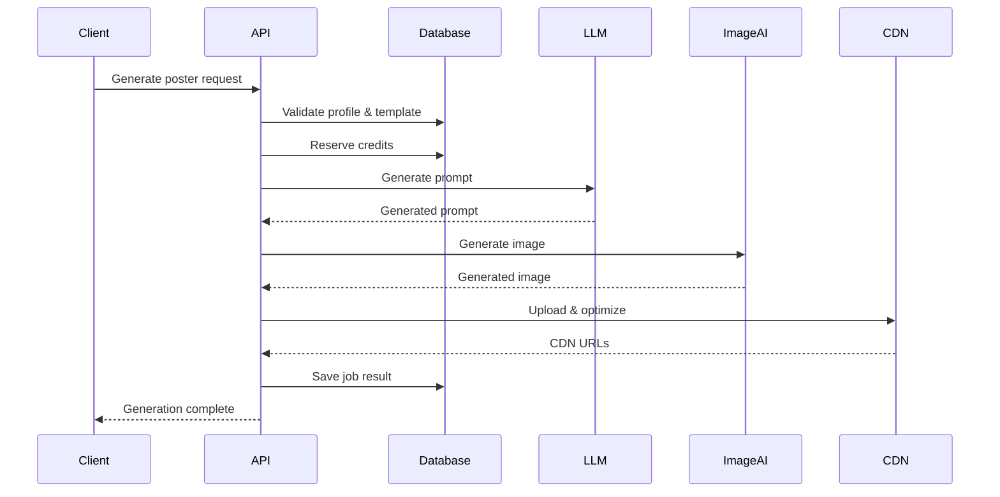
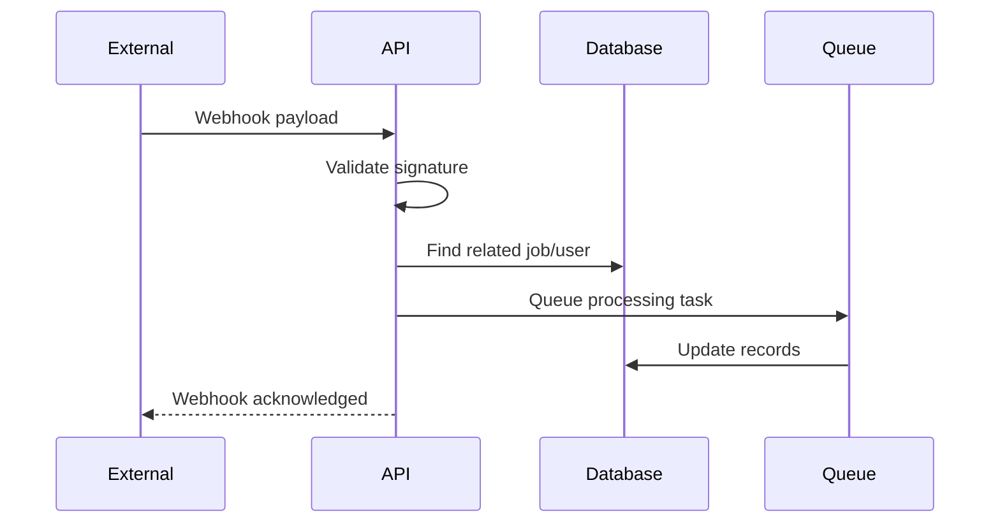
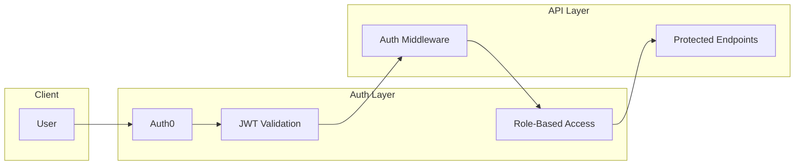

# Chapter 1: Overview & Architecture

## Table of Contents
- [System Overview](#system-overview)
- [Architecture Patterns](#architecture-patterns)
- [Technology Stack](#technology-stack)
- [System Components](#system-components)
- [Data Flow](#data-flow)
- [Scalability Considerations](#scalability-considerations)

## System Overview

Jomobit is an AI-powered poster generation platform designed to help businesses create professional marketing materials quickly and efficiently. The backend API serves as the core engine that orchestrates user management, business profiles, template systems, AI integrations, and billing operations.

### Core Value Proposition

**For Business Users:**
- Generate professional posters in minutes, not hours
- Maintain brand consistency across multiple business profiles
- Access curated templates optimized for different use cases
- Pay only for what you use with a credit-based system

**For Developers:**
- RESTful API with comprehensive documentation
- Secure authentication and authorization
- Reliable error handling and monitoring
- Scalable architecture supporting growth

### Key Business Metrics
- **User Engagement**: Template usage, generation frequency
- **Revenue**: Credit consumption, subscription conversions
- **Performance**: Generation success rate, response times
- **Quality**: User satisfaction, template popularity

## Architecture Patterns

### 1. Layered Architecture

The application follows a traditional layered architecture pattern:

### 2. Service-Oriented Architecture (SOA)

Business logic is organized into focused services:

- **User Service**: User management and profile operations
- **Profile Service**: Business profile CRUD operations
- **Template Service**: Template management and search
- **Generation Service**: AI poster generation orchestration
- **Credit Service**: Usage tracking and billing
- **Subscription Service**: Plan management and billing
- **Admin Service**: Administrative operations

### 3. Event-Driven Components

Certain operations use event-driven patterns:

- **Webhook Processing**: Auth0, payment, and AI provider webhooks
- **Job Queue**: Asynchronous poster generation
- **Audit Logging**: Security and usage events
- **Notification System**: User and admin notifications

## Technology Stack

### Core Technologies

| Component | Technology | Version | Purpose |
|-----------|------------|---------|---------|
| **Runtime** | Node.js | 18+ | JavaScript runtime environment |
| **Framework** | Express.js | 5.x | Web application framework |
| **Database** | MongoDB | 6.x | Primary data storage |
| **ODM** | Mongoose | 8.x | MongoDB object modeling |
| **Cache** | Redis | 7.x | Session and data caching |
| **Authentication** | Auth0 | Latest | Identity and access management |

### Security & Middleware

| Component | Technology | Purpose |
|-----------|------------|---------|
| **Security Headers** | Helmet.js | HTTP security headers |
| **CORS** | cors | Cross-origin resource sharing |
| **Rate Limiting** | express-rate-limit | API rate limiting |
| **Input Validation** | Joi + express-validator | Request validation |
| **Sanitization** | express-mongo-sanitize, xss-clean | Input sanitization |
| **Logging** | Winston + Morgan | Application logging |

### External Integrations

| Service | Purpose | Integration Type |
|---------|---------|------------------|
| **Auth0** | Authentication & user management | OAuth2/JWT + Webhooks |
| **OpenAI** | LLM for prompt generation | REST API + Webhooks |
| **Google Gemini** | Alternative LLM provider | REST API |
| **Ideogram AI** | Image generation | REST API + Webhooks |
| **ImageKit** | CDN and image optimization | REST API |
| **Razorpay** | Payment processing | REST API + Webhooks |

### Development & Testing

| Component | Technology | Purpose |
|-----------|------------|---------|
| **Testing Framework** | Jest | Unit and integration testing |
| **API Testing** | Supertest | HTTP endpoint testing |
| **Test Database** | MongoDB Memory Server | In-memory testing |
| **Code Coverage** | Jest Coverage | Test coverage reporting |
| **Development** | Nodemon | Development server |

## System Components

### 1. Application Core (`src/app.js`)

The main application class that orchestrates:
- Middleware initialization
- Route configuration
- Database connections
- Error handling
- Graceful shutdown

**Key Features:**
- Modular middleware stack
- Environment-specific configurations
- Comprehensive security setup
- Health check endpoints

### 2. Configuration Management (`src/config/`)

Centralized configuration for:
- **Database**: MongoDB connection and options
- **Redis**: Cache configuration and connection
- **Auth0**: JWT validation and user management
- **Security**: Rate limiting, CORS, and security headers
- **Swagger**: API documentation generation

### 3. Data Models (`src/models/`)

Mongoose schemas defining:
- **User**: Auth0 synchronized user data
- **BusinessProfile**: Business information for personalization
- **Template**: Poster templates with metadata
- **GenerationJob**: AI generation job tracking
- **CreditWallet**: User credit management
- **Subscription**: Billing and plan management

### 4. Business Services (`src/services/`)

Core business logic:
- **User Service**: User operations and Auth0 sync
- **Profile Service**: Business profile management
- **Template Service**: Template operations and search
- **Generation Service**: AI generation orchestration
- **Credit Service**: Usage tracking and billing
- **Admin Service**: Administrative operations

### 5. API Controllers (`src/controllers/`)

Request handling and response formatting:
- **Auth Controller**: Authentication endpoints
- **Profile Controller**: Business profile operations
- **Template Controller**: Template management
- **Poster Controller**: Generation endpoints
- **Subscription Controller**: Billing operations
- **Admin Controller**: Administrative endpoints
- **Webhook Controller**: External service webhooks

### 6. Middleware Stack (`src/middleware/`)

Request processing pipeline:
- **Authentication**: JWT validation and user context
- **Authorization**: Role-based access control
- **Validation**: Input validation and sanitization
- **Security**: Rate limiting and security headers
- **Logging**: Request/response logging
- **Error Handling**: Centralized error processing

## Data Flow

### 1. User Authentication Flow

### 2. Poster Generation Flow

### 3. Webhook Processing Flow

## Scalability Considerations

### 1. Database Optimization

**Indexing Strategy:**
- Compound indexes for common query patterns
- Text indexes for search functionality
- TTL indexes for temporary data cleanup

**Query Optimization:**
- Aggregation pipelines for complex queries
- Projection to limit returned fields
- Pagination for large result sets

### 2. Caching Strategy

**Redis Usage:**
- Session data caching
- Frequently accessed templates
- Rate limiting counters
- Job queue management

**Cache Invalidation:**
- Time-based expiration
- Event-driven invalidation
- Cache warming strategies

### 3. API Performance

**Rate Limiting Tiers:**
- General API: 100 requests/15 minutes
- Authentication: 20 requests/15 minutes
- Generation: 50 requests/hour
- Admin: 50 requests/15 minutes

**Response Optimization:**
- Gzip compression
- Efficient JSON serialization
- Minimal response payloads
- Streaming for large responses

### 4. Horizontal Scaling

**Stateless Design:**
- JWT-based authentication
- External session storage (Redis)
- Shared database connections
- Load balancer compatibility

**Microservice Readiness:**
- Service-oriented architecture
- Clear service boundaries
- API-first design
- Independent deployability

### 5. Monitoring & Observability

**Logging Strategy:**
- Structured JSON logging
- Correlation IDs for request tracking
- Security event logging
- Performance metrics

**Health Monitoring:**
- Application health endpoints
- Database connection monitoring
- External service health checks
- Resource usage tracking

## Security Architecture

### 1. Authentication & Authorization

### 2. Input Validation & Sanitization

- **Schema Validation**: Joi schemas for all inputs
- **SQL Injection Prevention**: MongoDB sanitization
- **XSS Prevention**: Input sanitization and output encoding
- **Path Traversal Prevention**: File path validation
- **Command Injection Prevention**: Input filtering

### 3. Rate Limiting & DDoS Protection

- **Tiered Rate Limits**: Different limits per endpoint type
- **IP-based Limiting**: Per-IP request tracking
- **User-based Limiting**: Per-user request tracking
- **Sliding Window**: Time-based limit windows

---

**Next Chapter**: [Getting Started](./02-getting-started.md) - Learn how to set up and run the Jomobit backend API locally.