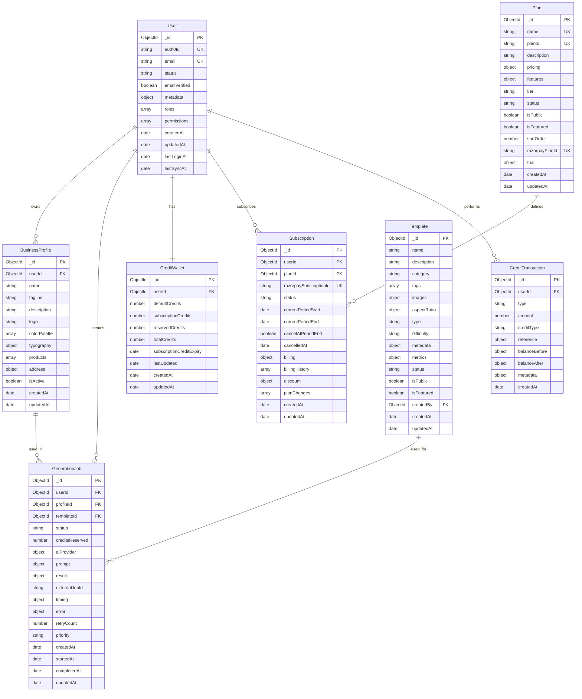

# Chapter 4: Database Design

## Table of Contents
- [Database Overview](#database-overview)
- [Data Models](#data-models)
- [Relationships & References](#relationships--references)
- [Indexing Strategy](#indexing-strategy)
- [Data Validation](#data-validation)
- [Performance Optimization](#performance-optimization)

## Database Overview

Jomobit uses MongoDB as the primary database with Mongoose ODM for object modeling. The database design follows document-oriented principles while maintaining referential integrity through careful schema design and validation.

### Database Architecture



## Data Models

### 1. User Model

The User model stores authentication and profile information synchronized from Auth0.

**Key Features:**
- Auth0 synchronization with webhook support
- Role-based access control (RBAC)
- Automatic timestamp management
- Email verification tracking
- User status management (active, suspended, pending)

**Schema Structure:**
```javascript
{
  auth0Id: { type: String, required: true, unique: true, index: true },
  email: { type: String, required: true, unique: true, lowercase: true, index: true },
  status: { type: String, enum: ['pending', 'active', 'suspended'], default: 'pending' },
  emailVerified: { type: Boolean, default: false },
  metadata: {
    name: String,
    given_name: String,
    family_name: String,
    nickname: String,
    picture: String,
    locale: String,
    updated_at: Date
  },
  roles: [{ type: String, enum: ['user', 'admin', 'moderator'] }],
  permissions: [String],
  createdAt: { type: Date, default: Date.now, index: true },
  updatedAt: { type: Date, default: Date.now },
  lastLoginAt: { type: Date, index: true },
  lastSyncAt: { type: Date, default: Date.now }
}
```

### 2. BusinessProfile Model

Stores business information for personalized poster generation.

**Key Features:**
- Multi-profile support per user
- Plan-based profile limits (Free: 1, Plus: 3, Pro: 8)
- Brand customization (colors, typography)
- Address and product information
- Text search capabilities

**Schema Structure:**
```javascript
{
  userId: { type: ObjectId, ref: 'User', required: true, index: true },
  name: { type: String, required: true, trim: true, maxlength: 100 },
  tagline: { type: String, required: true, trim: true, maxlength: 200 },
  description: { type: String, required: true, trim: true, maxlength: 1000 },
  logo: { type: String, trim: true }, // ImageKit URL
  colorPalette: [{
    name: { type: String, required: true },
    hex: { type: String, required: true, match: /^#([A-Fa-f0-9]{6}|[A-Fa-f0-9]{3})$/ }
  }],
  typography: {
    primary: { type: String, default: 'Arial' },
    secondary: { type: String, default: 'Helvetica' }
  },
  products: [{ type: String, trim: true, maxlength: 100 }],
  address: {
    street: String,
    city: String,
    state: String,
    country: String,
    zipCode: String
  },
  isActive: { type: Boolean, default: true, index: true }
}
```

### 3. Template Model

Manages poster templates with search and filtering capabilities.

**Key Features:**
- Comprehensive template metadata for AI generation
- Usage tracking and popularity metrics
- Multi-format image support (thumbnail, preview, full-size)
- Advanced search and filtering
- Category and tag-based organization

**Schema Structure:**
```javascript
{
  name: { type: String, required: true, trim: true, maxlength: 100 },
  description: { type: String, trim: true, maxlength: 500 },
  category: { type: String, required: true, trim: true, index: true },
  tags: [{ type: String, trim: true, lowercase: true, index: true }],
  images: {
    thumbnail: { type: String, required: true }, // ImageKit URL
    preview: { type: String, required: true },
    fullSize: { type: String, required: true }
  },
  aspectRatio: {
    width: { type: Number, required: true, min: 1 },
    height: { type: Number, required: true, min: 1 },
    ratio: { type: String, required: true } // e.g., "16:9", "1:1"
  },
  type: { type: String, enum: ['social', 'print', 'web', 'story', 'post', 'banner'] },
  difficulty: { type: String, enum: ['beginner', 'intermediate', 'advanced'] },
  metadata: {
    colorSchemes: [{ name: String, colors: [String] }],
    typography: [{ name: String, fontFamily: String, weight: String }],
    layout: {
      textAreas: [{ type: String, position: Object, maxLength: Number }],
      imageAreas: [{ type: String, position: Object }]
    },
    aiParameters: {
      promptTemplate: String,
      styleKeywords: [String],
      excludeKeywords: [String]
    }
  },
  metrics: {
    usageCount: { type: Number, default: 0, index: true },
    rating: { type: Number, default: 0, min: 0, max: 5 },
    ratingCount: { type: Number, default: 0 },
    lastUsed: { type: Date, index: true }
  },
  status: { type: String, enum: ['draft', 'active', 'inactive', 'archived'] },
  isPublic: { type: Boolean, default: true },
  isFeatured: { type: Boolean, default: false },
  createdBy: { type: ObjectId, ref: 'User' }
}
```

### 4. GenerationJob Model

Tracks AI poster generation jobs and their lifecycle.

**Key Features:**
- Complete job lifecycle tracking
- Multi-provider AI integration
- Performance monitoring
- Retry mechanism with limits
- Credit reservation system

**Schema Structure:**
```javascript
{
  userId: { type: ObjectId, ref: 'User', required: true, index: true },
  profileId: { type: ObjectId, ref: 'BusinessProfile', required: true },
  templateId: { type: ObjectId, ref: 'Template', required: true },
  status: { type: String, enum: ['pending', 'processing', 'completed', 'failed', 'cancelled'] },
  creditsReserved: { type: Number, required: true, min: 0 },
  aiProvider: {
    llm: { type: String, enum: ['openai', 'gemini'], required: true },
    diffusion: { type: String, enum: ['openai', 'ideogram'], required: true }
  },
  prompt: {
    generated: { type: String, maxlength: 2000 },
    parameters: { type: Mixed, default: {} },
    generatedAt: Date
  },
  result: {
    imageUrl: String, // Final ImageKit URL
    imagekitFileId: String,
    thumbnailUrl: String,
    metadata: { type: Mixed, default: {} }
  },
  externalJobId: { type: String, index: true },
  timing: {
    promptGenerationTime: Number, // milliseconds
    imageGenerationTime: Number,
    totalProcessingTime: Number
  },
  error: {
    message: String,
    code: String,
    provider: String,
    details: Mixed,
    occurredAt: Date
  },
  retryCount: { type: Number, default: 0, min: 0, max: 3 },
  priority: { type: String, enum: ['low', 'normal', 'high'], default: 'normal' }
}
```

### 5. CreditWallet Model

Manages user credits with different types and expiration rules.

**Key Features:**
- Multiple credit types with different expiration rules
- Credit reservation for pending jobs
- Automatic total calculation
- Expiry management for subscription credits

**Schema Structure:**
```javascript
{
  userId: { type: ObjectId, ref: 'User', required: true, unique: true },
  defaultCredits: { type: Number, default: 0, min: 0 }, // Never expire
  subscriptionCredits: { type: Number, default: 0, min: 0 }, // Monthly expiry
  reservedCredits: { type: Number, default: 0, min: 0 }, // Temporarily held
  totalCredits: { type: Number, default: 0, min: 0 }, // Computed field
  subscriptionCreditExpiry: { type: Date, index: true },
  lastUpdated: { type: Date, default: Date.now, index: true }
}
```

### 6. CreditTransaction Model

Maintains audit trail for all credit operations.

**Key Features:**
- Complete audit trail for all credit operations
- Before/after balance tracking
- Reference linking to related operations
- Support for different transaction types

**Schema Structure:**
```javascript
{
  userId: { type: ObjectId, ref: 'User', required: true, index: true },
  type: { type: String, enum: ['grant', 'reserve', 'deduct', 'release', 'expire'] },
  amount: { type: Number, required: true }, // Positive for additions, negative for deductions
  creditType: { type: String, enum: ['default', 'subscription', 'mixed'] },
  reference: {
    type: { type: String, enum: ['registration', 'subscription', 'generation', 'expiry', 'admin', 'refund'] },
    id: String, // Job ID, subscription ID, etc.
    description: String
  },
  balanceBefore: {
    defaultCredits: Number,
    subscriptionCredits: Number,
    reservedCredits: Number,
    totalCredits: Number
  },
  balanceAfter: {
    defaultCredits: Number,
    subscriptionCredits: Number,
    reservedCredits: Number,
    totalCredits: Number
  },
  metadata: { type: Mixed, default: {} }
}
```

### 7. Subscription Model

Manages user subscriptions and billing information.

**Key Features:**
- Complete subscription lifecycle management
- Razorpay integration with webhook support
- Trial period support
- Plan change tracking with proration
- Comprehensive billing history

### 8. Plan Model

Defines subscription plans with features and pricing.

**Key Features:**
- Flexible feature configuration
- Multi-tier plan support (Free, Plus, Pro)
- AI provider access control
- Trial period configuration
- Razorpay integration

## Relationships & References

### Reference Types

**One-to-One Relationships:**
- User ↔ CreditWallet (each user has exactly one wallet)

**One-to-Many Relationships:**
- User → BusinessProfile (user can have multiple profiles)
- User → GenerationJob (user can create multiple jobs)
- User → Subscription (user can have subscription history)
- BusinessProfile → GenerationJob (profile used in multiple generations)
- Template → GenerationJob (template used in multiple generations)

### Population Examples

```javascript
// User with related data
const user = await User.findById(userId)
  .populate('businessProfiles')
  .populate('activeSubscription');

// Generation job with references
const job = await GenerationJob.findById(jobId)
  .populate('userId', 'email metadata.name')
  .populate('profileId', 'name tagline')
  .populate('templateId', 'name images.thumbnail');

// Subscription with plan details
const subscription = await Subscription.findById(subscriptionId)
  .populate('userId', 'email')
  .populate('planId', 'name features pricing');
```

## Indexing Strategy

### Primary Indexes

All collections have carefully designed compound indexes for common query patterns:

**User Indexes:**
```javascript
db.users.createIndex({ auth0Id: 1 }, { unique: true });
db.users.createIndex({ email: 1 }, { unique: true });
db.users.createIndex({ status: 1, createdAt: -1 });
```

**BusinessProfile Indexes:**
```javascript
db.businessprofiles.createIndex({ userId: 1, isActive: 1 });
db.businessprofiles.createIndex({ userId: 1, createdAt: -1 });
db.businessprofiles.createIndex({ name: "text", description: "text" });
```

**Template Indexes:**
```javascript
db.templates.createIndex({ status: 1, isPublic: 1, createdAt: -1 });
db.templates.createIndex({ category: 1, type: 1, status: 1 });
db.templates.createIndex({ isFeatured: 1, status: 1, "metrics.usageCount": -1 });
db.templates.createIndex({
  name: "text",
  description: "text",
  tags: "text",
  category: "text"
});
```

**GenerationJob Indexes:**
```javascript
db.generationjobs.createIndex({ userId: 1, status: 1, createdAt: -1 });
db.generationjobs.createIndex({ userId: 1, profileId: 1, createdAt: -1 });
db.generationjobs.createIndex({ status: 1, createdAt: 1 }); // Job queue
db.generationjobs.createIndex({ externalJobId: 1, status: 1 });
```

## Data Validation

### Schema-Level Validation

Mongoose schemas provide comprehensive validation:

```javascript
const businessProfileSchema = new mongoose.Schema({
  name: {
    type: String,
    required: [true, 'Business name is required'],
    trim: true,
    minlength: [1, 'Business name cannot be empty'],
    maxlength: [100, 'Business name too long']
  },
  
  colorPalette: [{
    name: {
      type: String,
      required: [true, 'Color name is required']
    },
    hex: {
      type: String,
      required: [true, 'Color hex value is required'],
      match: [/^#([A-Fa-f0-9]{6}|[A-Fa-f0-9]{3})$/, 'Invalid hex color format']
    }
  }]
});
```

### Custom Validators

```javascript
// Email validation
const emailValidator = {
  validator: function(email) {
    return /^[^\s@]+@[^\s@]+\.[^\s@]+$/.test(email);
  },
  message: 'Invalid email format'
};

// Credit amount validation
const creditValidator = {
  validator: function(amount) {
    return amount >= 0 && Number.isInteger(amount);
  },
  message: 'Credits must be a non-negative integer'
};
```

## Performance Optimization

### Query Optimization

**Efficient Queries:**
```javascript
// Use indexes and projections
const templates = await Template.find({ 
  status: 'active', 
  isPublic: true 
})
.select('name description images.thumbnail aspectRatio')
.sort({ 'metrics.usageCount': -1 })
.limit(20);

// Use aggregation for complex queries
const userStats = await GenerationJob.aggregate([
  { $match: { userId: new ObjectId(userId) } },
  { $group: {
    _id: '$status',
    count: { $sum: 1 },
    totalCredits: { $sum: '$creditsReserved' }
  }}
]);
```

### Connection Pooling

```javascript
const mongooseOptions = {
  maxPoolSize: 10, // Maximum number of connections
  minPoolSize: 2,  // Minimum number of connections
  maxIdleTimeMS: 30000, // Close connections after 30 seconds of inactivity
  serverSelectionTimeoutMS: 5000, // How long to try selecting a server
  socketTimeoutMS: 45000, // How long a send or receive on a socket can take
  bufferMaxEntries: 0, // Disable mongoose buffering
  bufferCommands: false // Disable mongoose buffering
};
```

### Caching Strategy

```javascript
// Redis caching for frequently accessed data
const getCachedTemplate = async (templateId) => {
  const cacheKey = `template:${templateId}`;
  
  // Try cache first
  let template = await redisClient.get(cacheKey);
  if (template) {
    return JSON.parse(template);
  }
  
  // Fetch from database
  template = await Template.findById(templateId);
  if (template) {
    // Cache for 1 hour
    await redisClient.setEx(cacheKey, 3600, JSON.stringify(template));
  }
  
  return template;
};
```

---

**Next Chapter**: [API Endpoints](./05-api-endpoints.md) - Complete API reference with request/response examples and authentication requirements.