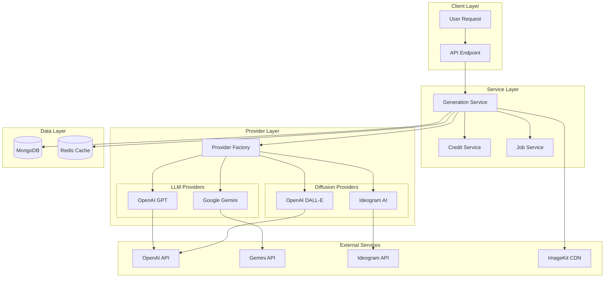
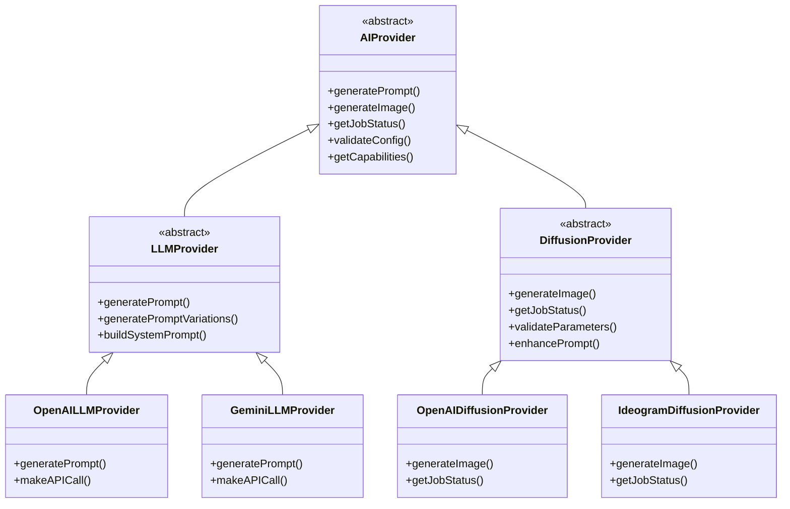
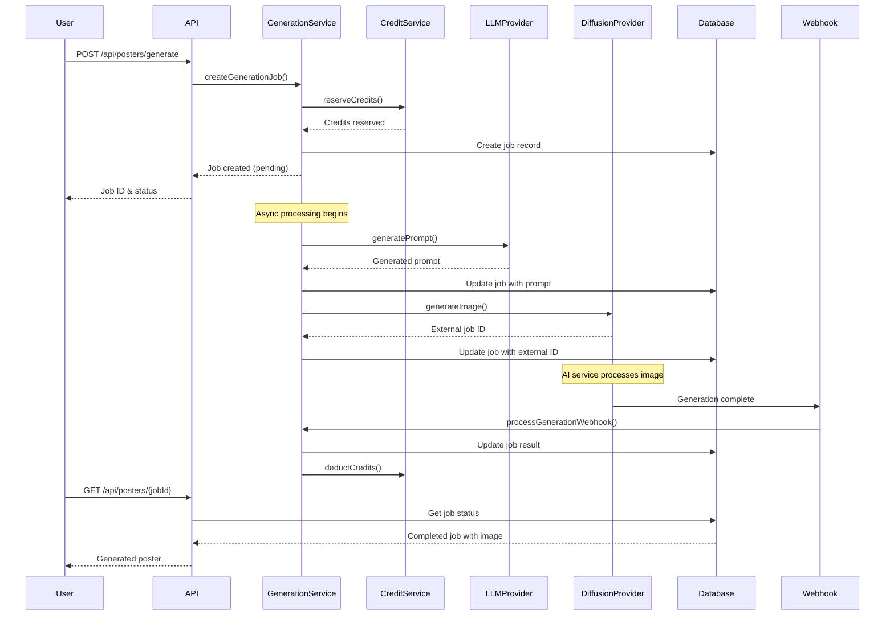
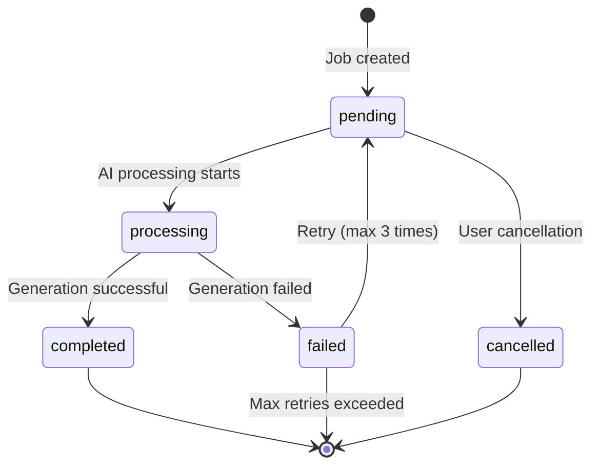
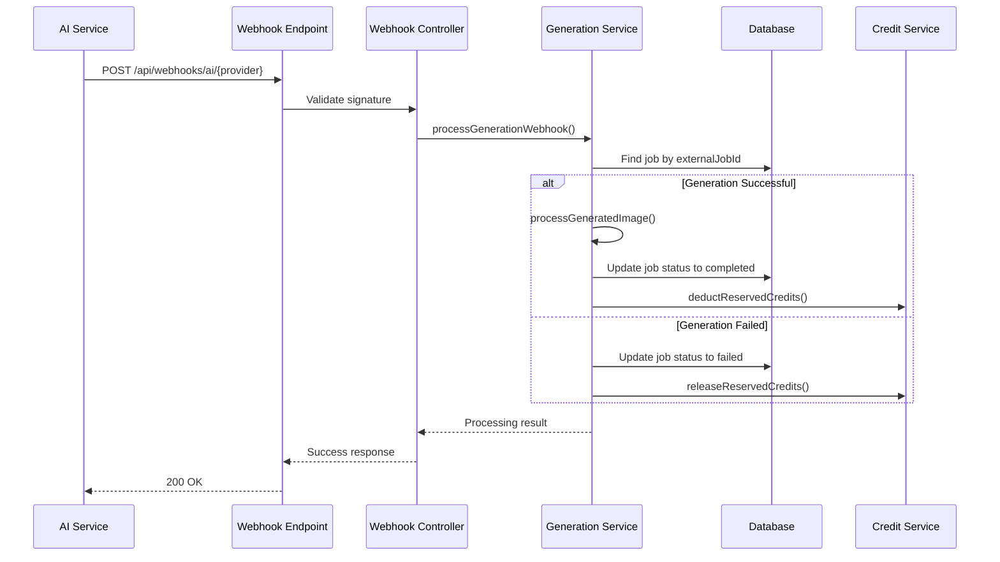

# Chapter 6: AI Integration

## Table of Contents
- [AI Architecture Overview](#ai-architecture-overview)
- [Provider System](#provider-system)
- [Generation Workflow](#generation-workflow)
- [Prompt Engineering](#prompt-engineering)
- [Image Generation](#image-generation)
- [Webhook Processing](#webhook-processing)
- [Error Handling & Retries](#error-handling--retries)
- [Performance Optimization](#performance-optimization)

## AI Architecture Overview

Jomobit's AI integration follows a modular, provider-agnostic architecture that supports multiple AI services for both text generation (LLM) and image generation (diffusion models). This design ensures flexibility, reliability, and easy integration of new AI providers.

### High-Level Architecture



### Core Components

1. **Generation Service**: Orchestrates the entire generation workflow
2. **Provider Factory**: Creates and manages AI provider instances
3. **Base Provider Classes**: Abstract interfaces for LLM and diffusion providers
4. **Concrete Providers**: Implementations for specific AI services
5. **Webhook System**: Handles asynchronous responses from AI services
6. **Credit System**: Manages usage tracking and billing

## Provider System

### Provider Architecture

The provider system uses an abstract factory pattern with specialized base classes for different AI capabilities:



### Provider Factory

The provider factory manages provider instantiation and configuration:

```javascript
// Provider Factory Implementation
class ProviderFactory {
  constructor() {
    this.llmProviders = new Map();
    this.diffusionProviders = new Map();
    this.initializeProviders();
  }

  initializeProviders() {
    // Register LLM providers
    this.llmProviders.set('openai', OpenAILLMProvider);
    this.llmProviders.set('gemini', GeminiLLMProvider);
    
    // Register diffusion providers
    this.diffusionProviders.set('openai', OpenAIDiffusionProvider);
    this.diffusionProviders.set('ideogram', IdeogramDiffusionProvider);
  }

  createLLMProvider(providerName, config = {}) {
    const ProviderClass = this.llmProviders.get(providerName);
    if (!ProviderClass) {
      throw new Error(`Unknown LLM provider: ${providerName}`);
    }
    return new ProviderClass(config);
  }

  createDiffusionProvider(providerName, config = {}) {
    const ProviderClass = this.diffusionProviders.get(providerName);
    if (!ProviderClass) {
      throw new Error(`Unknown diffusion provider: ${providerName}`);
    }
    return new ProviderClass(config);
  }
}
```

### Provider Capabilities

Each provider exposes its capabilities through a standardized interface:

```javascript
// Example provider capabilities
const openaiCapabilities = {
  supportsPromptGeneration: true,
  supportsImageGeneration: true,
  supportsJobStatus: false, // DALL-E is synchronous
  maxPromptLength: 8000,
  supportedModels: ['gpt-4', 'gpt-3.5-turbo'],
  supportedSizes: ['1024x1024', '1792x1024', '1024x1792'],
  supportedLanguages: ['en', 'es', 'fr', 'de', 'it'],
  isAsynchronous: false
};

const ideogramCapabilities = {
  supportsPromptGeneration: false,
  supportsImageGeneration: true,
  supportsJobStatus: true,
  maxPromptLength: 2000,
  supportedSizes: ['1:1', '16:10', '10:16', '16:9', '9:16'],
  supportedStyles: ['GENERAL', 'REALISTIC', 'DESIGN', 'RENDER_3D', 'ANIME'],
  isAsynchronous: true,
  supportsMagicPrompt: true,
  supportsNegativePrompt: true
};
```

## Generation Workflow

### Complete Generation Process



### Job States and Transitions



### Generation Service Implementation

```javascript
class GenerationService {
  async createGenerationJob(jobData) {
    const { userId, profileId, templateId, aiProvider, creditsRequired = 1 } = jobData;
    
    // 1. Validate request
    await this.validateGenerationRequest(userId, profileId, templateId, aiProvider);
    
    // 2. Reserve credits
    const job = await GenerationJob.createJob({
      userId, profileId, templateId,
      creditsReserved: creditsRequired,
      aiProvider, priority: 'normal'
    });
    
    // 3. Reserve credits with job reference
    await this.creditService.reserveCredits(userId, creditsRequired, job._id.toString());
    
    // 4. Start async processing
    this.processGenerationJob(job._id).catch(error => {
      logger.error('Background processing failed', { jobId: job._id, error });
    });
    
    return { success: true, job: job.getSummary() };
  }

  async processGenerationJob(jobId) {
    const job = await GenerationJob.findById(jobId)
      .populate('profileId')
      .populate('templateId');
    
    await job.startProcessing();
    
    try {
      // Step 1: Generate prompt
      const promptResult = await this.generatePrompt(job);
      await job.updatePrompt(promptResult.prompt, promptResult.parameters);
      
      // Step 2: Generate image
      const imageResult = await this.generateImage(job, promptResult.prompt);
      
      // For async providers, webhook will complete the job
      // For sync providers, complete immediately
      if (imageResult.status === 'completed') {
        await this.handleGenerationSuccess(job, imageResult);
      }
      
    } catch (error) {
      await this.handleGenerationFailure(jobId, error);
    }
  }
}
```

## Prompt Engineering

### Prompt Generation Strategy

Jomobit uses a sophisticated prompt engineering approach that combines business context, template requirements, and AI provider capabilities to generate effective prompts.

### System Prompt Template

```javascript
buildSystemPrompt(businessProfile, template) {
  return `You are an expert marketing copywriter specializing in creating compelling poster content.

BUSINESS CONTEXT:
Business: ${businessProfile.name}
Tagline: ${businessProfile.tagline}
Description: ${businessProfile.description}
Products/Services: ${businessProfile.products?.join(', ') || 'Various services'}
Brand Colors: ${businessProfile.colorPalette?.map(c => c.name).join(', ') || 'Not specified'}

TEMPLATE REQUIREMENTS:
Style: ${template.style || 'Professional'}
Target Audience: ${template.targetAudience || 'General consumers'}
Tone: ${template.tone || 'Engaging and professional'}
Aspect Ratio: ${template.aspectRatio.ratio}

INSTRUCTIONS:
Create marketing copy that is:
- Emotionally engaging and memorable
- Clear and easy to understand
- Action-oriented with strong call-to-action
- Aligned with brand personality
- Optimized for visual poster format
- Culturally appropriate and inclusive

Focus on benefits over features, create urgency when appropriate, and ensure the message resonates with the target audience.`;
}
```

### Provider-Specific Prompt Optimization

#### OpenAI GPT Prompts

```javascript
async generatePrompt(businessProfile, template) {
  const systemPrompt = this.buildSystemPrompt(businessProfile, template);
  
  const userPrompt = `Create a compelling marketing message for a poster that:
- Highlights the unique value proposition
- Includes a strong call-to-action
- Fits the ${template.style || 'professional'} style
- Is concise and impactful (max 50 words)
- Appeals to the target audience for ${businessProfile.products?.join(', ') || businessProfile.name}`;

  const response = await this.makeAPICall('/chat/completions', {
    model: this.model,
    messages: [
      { role: 'system', content: systemPrompt },
      { role: 'user', content: userPrompt }
    ],
    max_tokens: 200,
    temperature: 0.7
  });

  return response.choices[0].message.content.trim();
}
```

#### Google Gemini Prompts

```javascript
async generatePrompt(businessProfile, template) {
  const systemPrompt = this.buildSystemPrompt(businessProfile, template);
  
  const userPrompt = `Create a compelling marketing message for a poster that:
- Highlights the unique value proposition of ${businessProfile.name}
- Includes a strong call-to-action
- Fits the ${template.style || 'professional'} style
- Is concise and impactful (max 50 words)
- Appeals to customers interested in ${businessProfile.products?.join(', ') || 'our services'}
- Incorporates the tagline: "${businessProfile.tagline}"`;

  const prompt = `${systemPrompt}\n\nTask: ${userPrompt}`;

  const response = await this.makeAPICall(`/models/${this.model}:generateContent`, {
    contents: [{ parts: [{ text: prompt }] }],
    generationConfig: {
      temperature: 0.7,
      topK: 40,
      topP: 0.95,
      maxOutputTokens: 200
    },
    safetySettings: [
      {
        category: 'HARM_CATEGORY_HARASSMENT',
        threshold: 'BLOCK_MEDIUM_AND_ABOVE'
      }
      // ... other safety settings
    ]
  });

  return response.candidates[0].content.parts[0].text.trim();
}
```

### Prompt Enhancement Techniques

1. **Context Injection**: Include business-specific context
2. **Style Adaptation**: Adjust tone based on template requirements
3. **Length Optimization**: Ensure prompts fit within provider limits
4. **Safety Filtering**: Apply content safety measures
5. **Localization**: Support multiple languages where available

## Image Generation

### Diffusion Provider Integration

#### OpenAI DALL-E Integration

```javascript
class OpenAIDiffusionProvider extends DiffusionProvider {
  async generateImage(prompt, parameters = {}) {
    const validatedParams = this.validateParameters(parameters);
    const enhancedPrompt = this.enhancePrompt(prompt, validatedParams);

    const response = await this.makeAPICall('/images/generations', {
      model: this.model,
      prompt: enhancedPrompt,
      size: validatedParams.size,
      quality: validatedParams.quality === 'high' ? 'hd' : 'standard',
      n: 1
    });

    return {
      jobId: `openai_${Date.now()}_${Math.random().toString(36).substr(2, 9)}`,
      status: 'completed',
      imageUrl: response.data[0].url,
      revisedPrompt: response.data[0].revised_prompt,
      metadata: {
        model: this.model,
        size: validatedParams.size,
        quality: validatedParams.quality
      }
    };
  }
}
```

#### Ideogram AI Integration

```javascript
class IdeogramDiffusionProvider extends DiffusionProvider {
  async generateImage(prompt, parameters = {}) {
    const validatedParams = this.validateParameters(parameters);
    const enhancedPrompt = this.enhancePrompt(prompt, validatedParams);

    const response = await this.makeAPICall('/generate', {
      prompt: enhancedPrompt,
      aspect_ratio: this.convertSizeToAspectRatio(validatedParams.size),
      model: parameters.model || 'V_2',
      magic_prompt_option: parameters.magicPrompt || 'AUTO',
      style_type: this.mapStyleType(validatedParams.style),
      negative_prompt: parameters.negativePrompt || null
    });

    return {
      jobId: response.request_id,
      status: 'processing',
      metadata: {
        model: parameters.model || 'V_2',
        aspectRatio: this.convertSizeToAspectRatio(validatedParams.size),
        styleType: this.mapStyleType(validatedParams.style)
      }
    };
  }

  async getJobStatus(jobId) {
    const response = await this.makeAPICall(`/retrieve/${jobId}`, null, 'GET');
    const status = this.mapIdeogramStatus(response.status);

    const result = { jobId, status, message: response.message || null };

    if (status === 'completed' && response.data && response.data.length > 0) {
      result.imageUrl = response.data[0].url;
      result.metadata = {
        seed: response.data[0].seed,
        isPublic: response.data[0].is_public,
        safetyScore: response.data[0].safety_score
      };
    }

    return result;
  }
}
```

### Image Parameter Optimization

```javascript
prepareImageParameters(template) {
  const parameters = {
    size: `${template.aspectRatio.width}x${template.aspectRatio.height}`,
    quality: 'high',
    style: template.type === 'social' ? 'vibrant' : 'professional',
    format: 'png'
  };

  // Add template-specific parameters
  if (template.metadata?.aiParameters) {
    Object.assign(parameters, template.metadata.aiParameters);
  }

  return parameters;
}
```

### Prompt Enhancement for Image Generation

```javascript
enhancePrompt(prompt, parameters = {}) {
  let enhanced = prompt;

  // Add quality modifiers
  if (parameters.quality === 'high') {
    enhanced += ', high quality, detailed, professional';
  }

  // Add style modifiers
  if (parameters.style) {
    enhanced += `, ${parameters.style} style`;
  }

  // Add poster-specific enhancements
  enhanced += ', poster design, marketing material, clean composition';

  // Provider-specific enhancements
  if (this.constructor.name.includes('Ideogram')) {
    enhanced += ', professional poster design, marketing material';
    
    if (parameters.style === 'realistic') {
      enhanced += ', photorealistic, high detail';
    } else if (parameters.style === 'design') {
      enhanced += ', clean design, modern layout, typography';
    }
  }

  return enhanced;
}
```

## Webhook Processing

### Webhook Architecture



### Webhook Security

```javascript
// Signature validation for different providers
const webhookValidators = {
  auth0: (req, res, next) => {
    const signature = req.headers['x-auth0-signature'];
    const secret = process.env.AUTH0_WEBHOOK_SECRET;
    
    const expectedSignature = crypto
      .createHmac('sha256', secret)
      .update(req.rawBody)
      .digest('hex');

    if (!crypto.timingSafeEqual(
      Buffer.from(signature, 'hex'),
      Buffer.from(expectedSignature, 'hex')
    )) {
      return res.status(401).json({ error: 'Invalid signature' });
    }
    next();
  },

  ideogram: (req, res, next) => {
    const signature = req.headers['x-ideogram-signature'];
    const secret = process.env.IDEOGRAM_WEBHOOK_SECRET;
    
    // Ideogram-specific signature validation
    const expectedSignature = crypto
      .createHmac('sha256', secret)
      .update(req.rawBody)
      .digest('hex');

    if (signature !== expectedSignature) {
      return res.status(401).json({ error: 'Invalid signature' });
    }
    next();
  }
};
```

### Webhook Processing Logic

```javascript
async processGenerationWebhook(webhookData) {
  const { externalJobId, status, result, error } = webhookData;

  // Find job by external job ID
  const job = await GenerationJob.getJobByExternalId(externalJobId);
  if (!job) {
    return { success: false, error: 'Job not found', externalJobId };
  }

  // Update webhook data
  await job.updateWebhookData(webhookData);

  if (status === 'completed' && result) {
    return await this.handleGenerationSuccess(job, result);
  } else if (status === 'failed' || error) {
    return await this.handleGenerationFailure(job._id, error || { message: 'Generation failed' });
  } else {
    // Update job status for intermediate states
    job.status = status === 'processing' ? 'processing' : job.status;
    await job.save();
    
    return {
      success: true,
      jobId: job._id,
      status: job.status,
      message: 'Webhook processed successfully'
    };
  }
}
```

## Error Handling & Retries

### Error Classification

```javascript
class GenerationError extends Error {
  constructor(message, code, details = {}) {
    super(message);
    this.name = 'GenerationError';
    this.code = code;
    this.details = details;
  }
}

// Error types
const ERROR_CODES = {
  VALIDATION_ERROR: 'VALIDATION_ERROR',
  INSUFFICIENT_CREDITS: 'INSUFFICIENT_CREDITS',
  PROMPT_GENERATION_FAILED: 'PROMPT_GENERATION_FAILED',
  IMAGE_GENERATION_FAILED: 'IMAGE_GENERATION_FAILED',
  IMAGE_PROCESSING_FAILED: 'IMAGE_PROCESSING_FAILED',
  JOB_NOT_FOUND: 'JOB_NOT_FOUND',
  INVALID_JOB_STATUS: 'INVALID_JOB_STATUS',
  RETRY_NOT_ALLOWED: 'RETRY_NOT_ALLOWED'
};
```

### Retry Logic

```javascript
async retryGenerationJob(jobId, userId) {
  const job = await GenerationJob.getJobByIdForUser(jobId, userId);

  if (!job) {
    throw new GenerationError('Job not found or access denied', 'JOB_NOT_FOUND');
  }

  if (!job.canRetry()) {
    throw new GenerationError(
      `Job cannot be retried. Status: ${job.status}, Retries: ${job.retryCount}`,
      'RETRY_NOT_ALLOWED',
      { jobId, status: job.status, retryCount: job.retryCount }
    );
  }

  // Increment retry count and reset status
  await job.incrementRetry();
  job.status = 'pending';
  job.completedAt = undefined;
  await job.save();

  // Clear previous error
  await GenerationJob.updateOne({ _id: job._id }, { $unset: { error: 1 } });

  // Process the job again
  return await this.processGenerationJob(jobId);
}
```

### Failure Handling

```javascript
async handleGenerationFailure(jobId, error) {
  const job = await GenerationJob.findById(jobId);
  if (!job) {
    throw new GenerationError('Job not found for failure handling', 'JOB_NOT_FOUND');
  }

  // Mark job as failed
  await job.fail({
    message: error.message || 'Generation failed',
    code: error.code || 'GENERATION_FAILED',
    provider: error.provider || job.aiProvider.diffusion,
    details: error.details || error
  });

  // Release reserved credits
  try {
    await this.creditService.releaseReservedCredits(
      job._id.toString(),
      job.userId,
      job.creditsReserved,
      {
        failedAt: new Date(),
        errorMessage: error.message,
        provider: job.aiProvider
      }
    );
  } catch (creditError) {
    // Handle case where credits were already processed
    if (creditError.message.includes('Credits already processed')) {
      logger.warn('Credits already processed for job', { jobId });
    } else {
      throw creditError;
    }
  }

  return {
    success: false,
    jobId,
    status: 'failed',
    error: {
      message: error.message || 'Generation failed',
      code: error.code || 'GENERATION_FAILED'
    },
    creditsReleased: job.creditsReserved
  };
}
```

## Performance Optimization

### Caching Strategies

```javascript
// Provider instance caching
class ProviderCache {
  constructor() {
    this.llmCache = new Map();
    this.diffusionCache = new Map();
    this.cacheTimeout = 30 * 60 * 1000; // 30 minutes
  }

  getLLMProvider(providerName, config) {
    const cacheKey = `${providerName}_${JSON.stringify(config)}`;
    
    if (this.llmCache.has(cacheKey)) {
      const cached = this.llmCache.get(cacheKey);
      if (Date.now() - cached.timestamp < this.cacheTimeout) {
        return cached.provider;
      }
      this.llmCache.delete(cacheKey);
    }

    const provider = providerFactory.createLLMProvider(providerName, config);
    this.llmCache.set(cacheKey, {
      provider,
      timestamp: Date.now()
    });

    return provider;
  }
}
```

### Async Processing

```javascript
// Background job processing
class GenerationQueue {
  constructor() {
    this.processing = new Set();
    this.maxConcurrent = 10;
  }

  async processJob(jobId) {
    if (this.processing.has(jobId)) {
      return { success: false, message: 'Job already processing' };
    }

    if (this.processing.size >= this.maxConcurrent) {
      return { success: false, message: 'Queue full, try again later' };
    }

    this.processing.add(jobId);

    try {
      const result = await generationService.processGenerationJob(jobId);
      return result;
    } finally {
      this.processing.delete(jobId);
    }
  }
}
```

### Monitoring and Metrics

```javascript
// Performance tracking
class GenerationMetrics {
  constructor() {
    this.metrics = {
      promptGenerationTime: [],
      imageGenerationTime: [],
      totalProcessingTime: [],
      successRate: 0,
      errorCounts: new Map()
    };
  }

  recordPromptGeneration(duration, provider) {
    this.metrics.promptGenerationTime.push({
      duration,
      provider,
      timestamp: Date.now()
    });
  }

  recordImageGeneration(duration, provider) {
    this.metrics.imageGenerationTime.push({
      duration,
      provider,
      timestamp: Date.now()
    });
  }

  recordError(error, provider) {
    const key = `${provider}_${error.code}`;
    const count = this.metrics.errorCounts.get(key) || 0;
    this.metrics.errorCounts.set(key, count + 1);
  }

  getAverageProcessingTime(provider = null) {
    let times = this.metrics.totalProcessingTime;
    
    if (provider) {
      times = times.filter(t => t.provider === provider);
    }

    if (times.length === 0) return 0;
    
    const sum = times.reduce((acc, t) => acc + t.duration, 0);
    return sum / times.length;
  }
}
```

### Resource Management

```javascript
// Connection pooling and resource limits
const providerConfigs = {
  openai: {
    maxConcurrentRequests: 5,
    requestTimeout: 30000,
    retryAttempts: 3,
    retryDelay: 1000
  },
  ideogram: {
    maxConcurrentRequests: 3,
    requestTimeout: 60000,
    retryAttempts: 2,
    retryDelay: 2000
  },
  gemini: {
    maxConcurrentRequests: 4,
    requestTimeout: 25000,
    retryAttempts: 3,
    retryDelay: 1500
  }
};
```

---

**Next Chapter**: [Business Logic](./07-business-logic.md) - Learn about core services, credit system, subscription management, and business rules implementation.