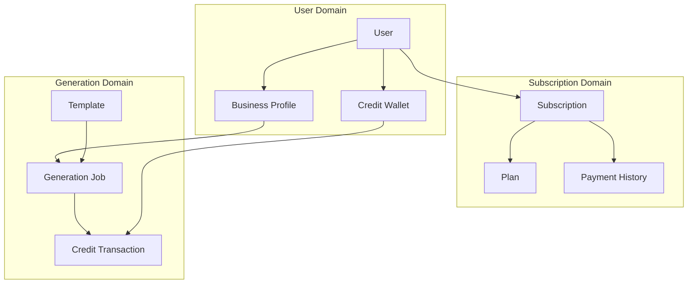
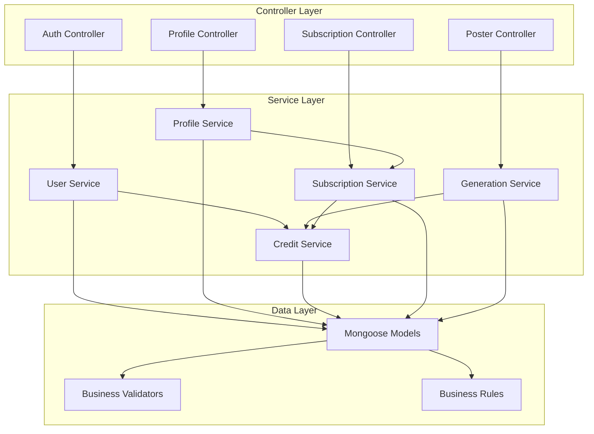
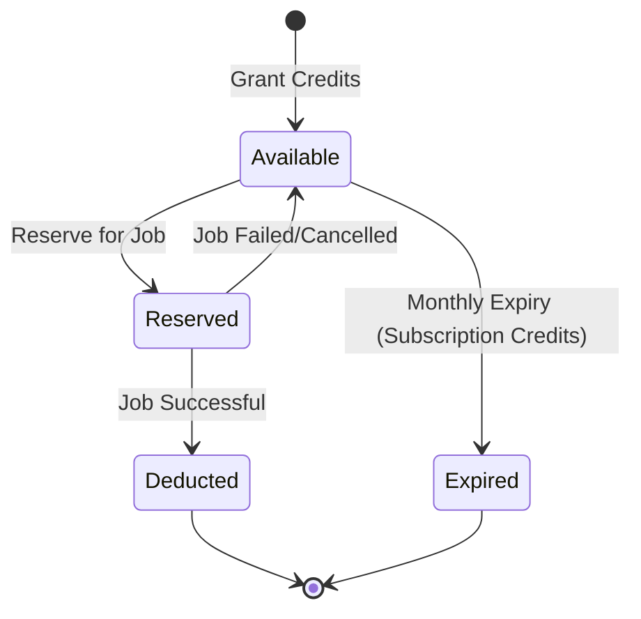
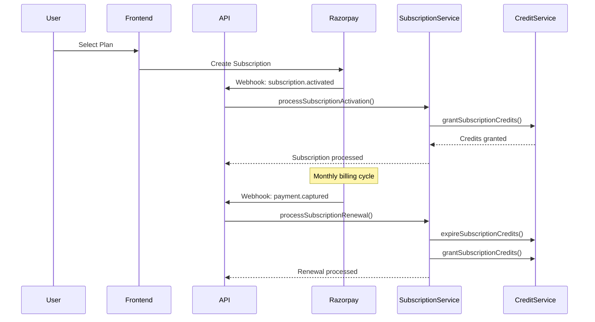

# Chapter 7: Business Logic

## Table of Contents
- [Business Logic Overview](#business-logic-overview)
- [Credit System](#credit-system)
- [Subscription Management](#subscription-management)
- [User Management](#user-management)
- [Profile Management](#profile-management)
- [Business Rules](#business-rules)
- [Service Integration](#service-integration)
- [Error Handling](#error-handling)

## Business Logic Overview

Jomobit's business logic is implemented through a service-oriented architecture that encapsulates core business rules, data validation, and complex operations. The system is designed around key business entities and their interactions.

### Core Business Entities



### Service Architecture



## Credit System

The credit system is the core monetization mechanism that tracks usage and manages billing.

### Credit Types and Lifecycle



### Credit Service Implementation

```javascript
class CreditService {
  constructor(options = {}) {
    this.DEFAULT_CREDITS = 3; // Default credits for new users
    this.useTransactions = options.useTransactions !== false;
  }

  // Core credit operations with ACID transaction support
  async grantDefaultCredits(userId, amount = this.DEFAULT_CREDITS, metadata = {}) {
    // Implementation with transaction support
    if (this.useTransactions) {
      return this._grantDefaultCreditsWithTransaction(userId, amount, metadata);
    } else {
      return this._grantDefaultCreditsWithoutTransaction(userId, amount, metadata);
    }
  }

  async reserveCredits(userId, amount, jobId, metadata = {}) {
    // Atomic credit reservation for generation jobs
    // Ensures credits are available before job processing
  }

  async deductReservedCredits(jobId, userId, amount, metadata = {}) {
    // Deduct credits after successful generation
    // Follows subscription-first, then default credit order
  }

  async releaseReservedCredits(jobId, userId, amount, metadata = {}) {
    // Release credits for failed/cancelled jobs
    // Maintains credit balance integrity
  }
}
```

### Credit Transaction Audit Trail

Every credit operation creates an audit record:

```javascript
const transactionRecord = {
  userId: ObjectId,
  type: 'grant' | 'reserve' | 'deduct' | 'release' | 'expire',
  amount: Number, // Positive for additions, negative for deductions
  creditType: 'default' | 'subscription' | 'mixed',
  reference: {
    type: 'registration' | 'subscription' | 'generation' | 'expiry' | 'admin',
    id: String, // Job ID, subscription ID, etc.
    description: String
  },
  balanceBefore: {
    defaultCredits: Number,
    subscriptionCredits: Number,
    reservedCredits: Number,
    totalCredits: Number
  },
  balanceAfter: {
    defaultCredits: Number,
    subscriptionCredits: Number,
    reservedCredits: Number,
    totalCredits: Number
  },
  metadata: Object,
  createdAt: Date
};
```

### Credit Business Rules

1. **Default Credits**: Never expire, granted once per user
2. **Subscription Credits**: Expire monthly, granted with each billing cycle
3. **Credit Deduction Order**: Subscription credits first, then default credits
4. **Reservation System**: Credits reserved during job processing, deducted on success
5. **Audit Trail**: Every operation logged for billing and support

### Credit Expiry Management

```javascript
async expireSubscriptionCredits(expiryDate = new Date()) {
  // Find wallets with expired subscription credits
  const expiredWallets = await CreditWallet.find({
    subscriptionCredits: { $gt: 0 },
    subscriptionCreditExpiry: { $lt: expiryDate }
  });

  const results = [];
  for (const wallet of expiredWallets) {
    const expiredAmount = wallet.subscriptionCredits;
    
    // Expire credits and create transaction record
    wallet.subscriptionCredits = 0;
    wallet.subscriptionCreditExpiry = null;
    await wallet.save();

    // Create expiry transaction
    await CreditTransaction.createTransaction({
      userId: wallet.userId,
      type: 'expire',
      amount: -expiredAmount,
      creditType: 'subscription',
      reference: {
        type: 'expiry',
        id: `expiry_${Date.now()}_${wallet.userId}`,
        description: 'Monthly subscription credit expiration'
      },
      balanceBefore: { /* ... */ },
      balanceAfter: { /* ... */ },
      metadata: { expiredAt: new Date(), reason: 'monthly_expiration' }
    });
  }

  return { walletsProcessed: expiredWallets.length, totalExpiredCredits };
}
```

## Subscription Management

The subscription system handles billing, plan management, and credit allocation.

### Subscription Lifecycle



### Plan-Based Features

```javascript
const planFeatures = {
  free: {
    credits: { monthly: 3, rollover: false },
    businessProfiles: { limit: 1 },
    templates: { access: 'basic' },
    aiProviders: { llm: ['openai'], diffusion: ['openai'] },
    additional: { prioritySupport: false, analytics: false }
  },
  plus: {
    credits: { monthly: 50, rollover: false },
    businessProfiles: { limit: 3 },
    templates: { access: 'premium' },
    aiProviders: { llm: ['openai', 'gemini'], diffusion: ['openai', 'ideogram'] },
    additional: { prioritySupport: true, analytics: true }
  },
  pro: {
    credits: { monthly: 120, rollover: true },
    businessProfiles: { limit: 8 },
    templates: { access: 'all', customTemplates: true },
    aiProviders: { llm: ['openai', 'gemini'], diffusion: ['openai', 'ideogram'] },
    additional: { prioritySupport: true, analytics: true, apiAccess: true, whiteLabel: true }
  }
};
```

### Subscription Service Implementation

```javascript
class SubscriptionService {
  async createSubscription(webhookData) {
    const { subscription: razorpaySubscription, payment } = webhookData;
    
    // Find user and plan
    const user = await this._findUserFromWebhook(webhookData);
    const plan = await Plan.getByRazorpayId(razorpaySubscription.plan_id);
    
    // Create subscription record
    const subscription = await Subscription.createSubscription({
      userId: user._id,
      planId: plan._id,
      razorpaySubscriptionId: razorpaySubscription.id,
      currentPeriodStart: new Date(razorpaySubscription.current_start * 1000),
      currentPeriodEnd: new Date(razorpaySubscription.current_end * 1000),
      billing: {
        currency: plan.pricing.currency,
        amount: plan.pricing.amount,
        interval: plan.pricing.interval
      },
      status: razorpaySubscription.status === 'active' ? 'active' : 'pending'
    });

    // Grant subscription credits if active
    if (subscription.status === 'active') {
      await this._grantSubscriptionCredits(subscription, plan);
    }

    return { success: true, subscription, plan, user };
  }

  async upgradeSubscription(userId, newPlanId, options = {}) {
    const currentSubscription = await Subscription.getUserActiveSubscription(userId);
    const newPlan = await Plan.getByPlanId(newPlanId);
    const currentPlan = await Plan.findById(currentSubscription.planId);

    // Calculate prorated amount
    const proratedAmount = currentPlan.calculateProratedAmount(
      newPlan,
      new Date(),
      currentSubscription.currentPeriodEnd
    );

    // Update subscription
    await currentSubscription.changePlan(newPlan._id, 'upgrade', proratedAmount);
    
    // Grant additional credits for remaining period
    const remainingDays = Math.ceil(
      (currentSubscription.currentPeriodEnd - new Date()) / (1000 * 60 * 60 * 24)
    );
    const creditDifference = newPlan.features.credits.monthly - currentPlan.features.credits.monthly;
    const proratedCredits = Math.floor((creditDifference * remainingDays) / 30);

    if (proratedCredits > 0) {
      await this.creditService.grantSubscriptionCredits(
        userId,
        proratedCredits,
        currentSubscription.currentPeriodEnd,
        currentSubscription._id.toString(),
        { reason: 'plan_upgrade', proratedCredits: true }
      );
    }

    return { success: true, subscription: currentSubscription, newPlan, proratedAmount };
  }
}
```

### Billing and Payment Processing

```javascript
async processSubscriptionRenewal(webhookData) {
  const { subscription: razorpaySubscription, payment } = webhookData;
  
  const subscription = await Subscription.getByRazorpayId(razorpaySubscription.id);
  
  // Update subscription period
  await subscription.updatePeriod(
    new Date(razorpaySubscription.current_start * 1000),
    new Date(razorpaySubscription.current_end * 1000)
  );

  // Add payment to billing history
  await subscription.addPayment({
    razorpayPaymentId: payment.id,
    amount: payment.amount,
    currency: payment.currency,
    status: payment.status,
    paymentMethod: payment.method,
    paidAt: new Date(payment.created_at * 1000)
  });

  // Expire old credits and grant new ones
  await this.creditService.expireSubscriptionCredits(new Date());
  
  const plan = await Plan.findById(subscription.planId);
  await this._grantSubscriptionCredits(subscription, plan);

  return { success: true, subscription, message: 'Subscription renewed successfully' };
}
```

## User Management

User management handles the complete user lifecycle from registration to account management.

### User Service Implementation

```javascript
class UserService {
  constructor(options = {}) {
    this.creditService = options.creditService || new CreditService();
  }

  async createOrUpdateFromAuth0(auth0User, options = {}) {
    const { grantDefaultCredits = true } = options;
    
    // Create or update user using model method
    const user = await User.createOrUpdateFromAuth0(auth0User);
    const isNewUser = user.createdAt.getTime() === user.updatedAt.getTime();

    let creditResult = null;

    // Grant default credits for new users
    if (isNewUser && grantDefaultCredits) {
      try {
        creditResult = await this.creditService.grantDefaultCredits(
          user._id,
          this.creditService.DEFAULT_CREDITS,
          {
            source: 'user_registration',
            auth0Id: auth0User.user_id,
            email: auth0User.email
          }
        );
      } catch (creditError) {
        // Log error but don't fail user creation
        logger.error('Failed to grant default credits', { userId: user._id, error: creditError.message });
      }
    }

    return {
      success: true,
      user: user.toObject(),
      isNewUser,
      creditResult,
      message: isNewUser ? 'User created successfully' : 'User updated successfully'
    };
  }
}
```

### Auth0 Integration

```javascript
// User model method for Auth0 synchronization
async createOrUpdateFromAuth0(auth0User) {
  const userData = {
    auth0Id: auth0User.user_id,
    email: auth0User.email?.toLowerCase(),
    emailVerified: auth0User.email_verified || false,
    status: auth0User.email_verified ? 'active' : 'pending',
    metadata: {
      name: auth0User.name,
      given_name: auth0User.given_name,
      family_name: auth0User.family_name,
      nickname: auth0User.nickname,
      picture: auth0User.picture,
      locale: auth0User.locale,
      updated_at: auth0User.updated_at ? new Date(auth0User.updated_at) : new Date()
    },
    roles: auth0User['https://jomobit.com/roles'] || ['user'],
    permissions: auth0User.permissions || [],
    lastSyncAt: new Date()
  };

  // Update last login if login event
  if (auth0User.last_login) {
    userData.lastLoginAt = new Date(auth0User.last_login);
  }

  return this.findOneAndUpdate(
    { auth0Id: auth0User.user_id },
    userData,
    { upsert: true, new: true, runValidators: true }
  ).exec();
}
```

## Profile Management

Business profile management enforces plan-based limitations and maintains data integrity.

### Profile Service Implementation

```javascript
class ProfileService {
  constructor() {
    this.EDITABLE_FIELDS = ['tagline', 'products', 'colorPalette', 'typography'];
    this.REQUIRED_FIELDS = ['name', 'tagline', 'description'];
  }

  async createProfile(userId, profileData) {
    // Validate required fields
    this._validateRequiredFields(profileData);

    // Get user's plan and check limits
    const userPlan = await this.getUserPlan(userId);
    const currentCount = await BusinessProfile.getUserProfileCount(userId);

    if (currentCount >= userPlan.profileLimit) {
      throw new PlanLimitExceededError(
        currentCount,
        userPlan.profileLimit,
        userPlan.planName
      );
    }

    // Create profile with sanitized data
    const sanitizedData = this._sanitizeProfileData(profileData);
    const profile = new BusinessProfile({ userId, ...sanitizedData });
    await profile.save();

    return {
      success: true,
      profile: profile.toObject(),
      planInfo: {
        currentCount: currentCount + 1,
        limit: userPlan.profileLimit,
        planName: userPlan.planName
      }
    };
  }

  async updateProfile(userId, profileId, updates) {
    const profile = await BusinessProfile.getProfileByIdForUser(profileId, userId);
    if (!profile) {
      throw new ProfileNotFoundError(profileId);
    }

    // Filter updates to only include editable fields
    const editableUpdates = this._filterEditableFields(updates);
    this._validateUpdateData(editableUpdates);

    await profile.updateEditableFields(editableUpdates);

    return {
      success: true,
      profile: profile.toObject(),
      updatedFields: Object.keys(editableUpdates)
    };
  }
}
```

### Plan-Based Profile Limits

```javascript
async getUserPlan(userId) {
  // Get user's active subscription
  const subscription = await Subscription.getUserActiveSubscription(userId);
  
  if (subscription && subscription.planId) {
    return {
      plan: subscription.planId,
      planName: subscription.planId.name,
      profileLimit: subscription.planId.features.businessProfiles.limit
    };
  }

  // Default to free plan
  const freePlan = await Plan.getFreePlan();
  return {
    plan: freePlan,
    planName: 'Free',
    profileLimit: BusinessProfile.PLAN_LIMITS.free // 1 profile
  };
}
```

### Profile Validation Rules

```javascript
_validateRequiredFields(profileData) {
  for (const field of this.REQUIRED_FIELDS) {
    if (!profileData[field] || !profileData[field].trim()) {
      throw new ProfileValidationError(
        `Required field '${field}' is missing or empty`,
        field,
        profileData[field]
      );
    }
  }
}

_validateUpdateData(updates) {
  // Validate tagline
  if (updates.tagline !== undefined) {
    if (typeof updates.tagline !== 'string' || updates.tagline.trim().length === 0) {
      throw new ProfileValidationError('Tagline must be a non-empty string', 'tagline', updates.tagline);
    }
    if (updates.tagline.length > 200) {
      throw new ProfileValidationError('Tagline must be 200 characters or less', 'tagline', updates.tagline);
    }
  }

  // Validate color palette
  if (updates.colorPalette !== undefined) {
    for (const color of updates.colorPalette) {
      if (!color.name || !color.hex) {
        throw new ProfileValidationError('Each color must have name and hex properties', 'colorPalette', color);
      }
      if (!/^#([A-Fa-f0-9]{6}|[A-Fa-f0-9]{3})$/.test(color.hex)) {
        throw new ProfileValidationError('Invalid hex color format', 'colorPalette', color.hex);
      }
    }
  }
}
```

## Business Rules

### Core Business Rules Implementation

```javascript
// Plan limits enforcement
const PLAN_LIMITS = {
  free: {
    businessProfiles: 1,
    monthlyCredits: 3,
    templates: 'basic',
    aiProviders: ['openai']
  },
  plus: {
    businessProfiles: 3,
    monthlyCredits: 50,
    templates: 'premium',
    aiProviders: ['openai', 'gemini', 'ideogram']
  },
  pro: {
    businessProfiles: 8,
    monthlyCredits: 120,
    templates: 'all',
    aiProviders: ['openai', 'gemini', 'ideogram'],
    creditRollover: true
  }
};

// Credit deduction priority
const CREDIT_DEDUCTION_ORDER = [
  'subscription', // Expire monthly
  'default'       // Never expire
];

// Profile field editability
const PROFILE_FIELD_RULES = {
  editable: ['tagline', 'products', 'colorPalette', 'typography'],
  immutable: ['name', 'description', 'logo', 'address'],
  required: ['name', 'tagline', 'description']
};
```

### Validation Rules

```javascript
// Business profile validation
const profileValidationRules = {
  name: {
    required: true,
    maxLength: 100,
    minLength: 1
  },
  tagline: {
    required: true,
    maxLength: 200,
    minLength: 1
  },
  description: {
    required: true,
    maxLength: 1000,
    minLength: 1
  },
  colorPalette: {
    maxItems: 10,
    itemValidation: {
      name: { required: true },
      hex: { required: true, pattern: /^#([A-Fa-f0-9]{6}|[A-Fa-f0-9]{3})$/ }
    }
  },
  products: {
    maxItems: 20,
    itemMaxLength: 100
  }
};

// Credit operation validation
const creditValidationRules = {
  amount: {
    required: true,
    type: 'number',
    min: 0,
    integer: true
  },
  userId: {
    required: true,
    type: 'objectId'
  },
  jobId: {
    required: true,
    type: 'string',
    minLength: 1
  }
};
```

## Service Integration

### Service Dependencies

```mermaid
graph TB
    subgraph "Service Dependencies"
        GEN_SVC[Generation Service]
        CREDIT_SVC[Credit Service]
        PROFILE_SVC[Profile Service]
        SUB_SVC[Subscription Service]
        USER_SVC[User Service]
    end
    
    GEN_SVC --> CREDIT_SVC
    GEN_SVC --> PROFILE_SVC
    PROFILE_SVC --> SUB_SVC
    SUB_SVC --> CREDIT_SVC
    USER_SVC --> CREDIT_SVC
    
    GEN_SVC -.-> "AI Providers"
    SUB_SVC -.-> "Razorpay API"
    USER_SVC -.-> "Auth0 API"
```

### Cross-Service Communication

```javascript
// Generation Service using Credit Service
class GenerationService {
  constructor(options = {}) {
    this.creditService = options.creditService || new CreditService();
  }

  async createGenerationJob(jobData) {
    // Reserve credits before processing
    const job = await GenerationJob.createJob(jobData);
    
    const creditReservation = await this.creditService.reserveCredits(
      jobData.userId,
      jobData.creditsRequired,
      job._id.toString()
    );

    return { job, creditReservation };
  }

  async handleGenerationSuccess(job, result) {
    // Deduct reserved credits on success
    await this.creditService.deductReservedCredits(
      job._id.toString(),
      job.userId,
      job.creditsReserved
    );

    await job.complete(result);
    return { success: true, job };
  }

  async handleGenerationFailure(jobId, error) {
    // Release reserved credits on failure
    const job = await GenerationJob.findById(jobId);
    
    await this.creditService.releaseReservedCredits(
      job._id.toString(),
      job.userId,
      job.creditsReserved
    );

    await job.fail(error);
    return { success: false, job, error };
  }
}
```

### Service Configuration

```javascript
// Service factory for dependency injection
class ServiceFactory {
  constructor() {
    this.services = new Map();
  }

  createCreditService(options = {}) {
    if (!this.services.has('creditService')) {
      this.services.set('creditService', new CreditService(options));
    }
    return this.services.get('creditService');
  }

  createUserService(options = {}) {
    if (!this.services.has('userService')) {
      const creditService = this.createCreditService();
      this.services.set('userService', new UserService({ creditService, ...options }));
    }
    return this.services.get('userService');
  }

  createSubscriptionService(options = {}) {
    if (!this.services.has('subscriptionService')) {
      const creditService = this.createCreditService();
      this.services.set('subscriptionService', new SubscriptionService({ creditService, ...options }));
    }
    return this.services.get('subscriptionService');
  }

  createGenerationService(options = {}) {
    if (!this.services.has('generationService')) {
      const creditService = this.createCreditService();
      this.services.set('generationService', new GenerationService({ creditService, ...options }));
    }
    return this.services.get('generationService');
  }
}
```

## Error Handling

### Custom Error Classes

```javascript
// Credit system errors
class CreditInsufficientError extends Error {
  constructor(required, available) {
    super(`Insufficient credits: required ${required}, available ${available}`);
    this.name = 'CreditInsufficientError';
    this.code = 'INSUFFICIENT_CREDITS';
    this.required = required;
    this.available = available;
  }
}

class CreditOperationError extends Error {
  constructor(message, operation, userId) {
    super(message);
    this.name = 'CreditOperationError';
    this.code = 'CREDIT_OPERATION_ERROR';
    this.operation = operation;
    this.userId = userId;
  }
}

// Profile system errors
class PlanLimitExceededError extends Error {
  constructor(currentCount, limit, planName) {
    super(`Plan limit exceeded: ${currentCount}/${limit} profiles for ${planName} plan`);
    this.name = 'PlanLimitExceededError';
    this.code = 'PLAN_LIMIT_EXCEEDED';
    this.currentCount = currentCount;
    this.limit = limit;
    this.planName = planName;
  }
}

class ProfileValidationError extends Error {
  constructor(message, field, value) {
    super(message);
    this.name = 'ProfileValidationError';
    this.code = 'PROFILE_VALIDATION_ERROR';
    this.field = field;
    this.value = value;
  }
}

// Subscription system errors
class SubscriptionError extends Error {
  constructor(message, code, details = {}) {
    super(message);
    this.name = 'SubscriptionError';
    this.code = code;
    this.details = details;
  }
}
```

### Error Handling Patterns

```javascript
// Service-level error handling
class ProfileService {
  async createProfile(userId, profileData) {
    try {
      // Business logic implementation
      return await this._createProfileCore(userId, profileData);
    } catch (error) {
      // Re-throw known business errors
      if (error instanceof PlanLimitExceededError || 
          error instanceof ProfileValidationError) {
        throw error;
      }

      // Wrap unknown errors
      logger.error('Error creating business profile', {
        userId,
        profileData: { name: profileData.name },
        error: error.message,
        stack: error.stack
      });
      
      throw new ProfileOperationError(
        `Failed to create profile: ${error.message}`,
        'createProfile',
        userId
      );
    }
  }
}

// Controller-level error handling
class ProfileController {
  async createProfile(req, res) {
    try {
      const result = await this.profileService.createProfile(req.user.id, req.body);
      res.status(201).json(result);
    } catch (error) {
      if (error instanceof PlanLimitExceededError) {
        return res.status(402).json({
          error: error.message,
          code: error.code,
          details: {
            currentCount: error.currentCount,
            limit: error.limit,
            planName: error.planName
          }
        });
      }

      if (error instanceof ProfileValidationError) {
        return res.status(400).json({
          error: error.message,
          code: error.code,
          field: error.field
        });
      }

      // Generic error handling
      logger.error('Profile creation failed', { error: error.message, userId: req.user.id });
      res.status(500).json({
        error: 'Internal server error',
        code: 'INTERNAL_ERROR'
      });
    }
  }
}
```

### Transaction Error Handling

```javascript
// ACID transaction with error handling
async _grantDefaultCreditsWithTransaction(userId, amount, metadata) {
  const session = await mongoose.startSession();
  
  try {
    return await session.withTransaction(async () => {
      return this._grantDefaultCreditsCore(userId, amount, metadata, session);
    });
  } catch (error) {
    logger.error('Error granting default credits', {
      userId,
      amount,
      error: error.message,
      stack: error.stack
    });
    throw error;
  } finally {
    await session.endSession();
  }
}
```

---

**Next Chapter**: [Testing Strategy](./08-testing-strategy.md) - Learn about comprehensive testing approaches including unit, integration, and E2E testing strategies.