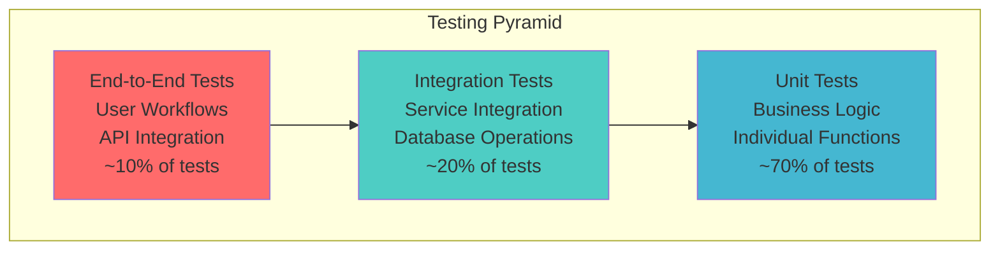
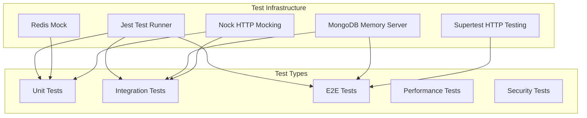

# Chapter 8: Testing Strategy

## Table of Contents
- [Testing Overview](#testing-overview)
- [Testing Architecture](#testing-architecture)
- [Test Environment Setup](#test-environment-setup)
- [Unit Testing](#unit-testing)
- [Integration Testing](#integration-testing)
- [End-to-End Testing](#end-to-end-testing)
- [Performance Testing](#performance-testing)
- [Security Testing](#security-testing)
- [Test Infrastructure](#test-infrastructure)
- [Testing Best Practices](#testing-best-practices)
- [Continuous Integration](#continuous-integration)
- [Test Coverage and Reporting](#test-coverage-and-reporting)

## Testing Overview

Jomobit employs a comprehensive testing strategy that ensures code quality, reliability, and maintainability across all system components. The testing approach follows the testing pyramid principle with a strong foundation of unit tests, supported by integration tests, and topped with end-to-end tests.

### Testing Philosophy

Our testing strategy is built on these core principles:

1. **Test-Driven Development (TDD)**: Write tests before implementation
2. **Comprehensive Coverage**: Aim for high test coverage across all layers
3. **Fast Feedback**: Quick test execution for rapid development cycles
4. **Isolation**: Tests should be independent and not affect each other
5. **Realistic Testing**: Use real databases and services where appropriate
6. **Continuous Testing**: Automated testing in CI/CD pipeline

### Testing Pyramid



### Test Categories

1. **Unit Tests**: Test individual functions, methods, and classes in isolation
2. **Integration Tests**: Test interactions between services, databases, and external APIs
3. **End-to-End Tests**: Test complete user workflows and system behavior
4. **Performance Tests**: Test system performance under load and stress conditions
5. **Security Tests**: Test authentication, authorization, and vulnerability protection

## Testing Architecture

### Test Infrastructure Overview



### Technology Stack

- **Test Runner**: Jest
- **HTTP Testing**: Supertest
- **Database Testing**: MongoDB Memory Server
- **Mocking**: Jest mocks, Nock for HTTP
- **Coverage**: Istanbul (built into Jest)
- **Performance Testing**: Artillery, Jest performance tests
- **Security Testing**: Custom security test suites

## Test Environment Setup

### Jest Configuration

```javascript
// jest.config.js
module.exports = {
  testEnvironment: 'node',
  testMatch: [
    '**/tests/**/*.test.js',
    '**/tests/**/*.spec.js'
  ],
  setupFilesAfterEnv: ['<rootDir>/tests/setup/jest.setup.js'],
  globalSetup: '<rootDir>/tests/setup/globalSetup.js',
  globalTeardown: '<rootDir>/tests/setup/globalTeardown.js',
  collectCoverageFrom: [
    'src/**/*.js',
    '!src/**/*.test.js',
    '!**/node_modules/**',
    '!**/tests/**'
  ],
  coverageThreshold: {
    global: {
      branches: 80,
      functions: 80,
      lines: 80,
      statements: 80
    },
    './src/services/': {
      branches: 90,
      functions: 90,
      lines: 90,
      statements: 90
    }
  },
  testTimeout: 30000,
  verbose: true,
  clearMocks: true,
  restoreMocks: true,
  maxWorkers: 4,
  detectOpenHandles: true,
  forceExit: true
};
```

### Global Test Setup

```javascript
// tests/setup/globalSetup.js
const { MongoMemoryServer } = require('mongodb-memory-server');
const Redis = require('ioredis-mock');

module.exports = async () => {
  // Setup MongoDB Memory Server
  const mongod = new MongoMemoryServer({
    binary: { version: '7.0.0', skipMD5: true },
    instance: { dbName: 'jomobit-test' }
  });

  await mongod.start();
  const uri = mongod.getUri();
  
  global.__MONGOD__ = mongod;
  global.__MONGO_URI__ = uri;
  
  // Setup Redis Mock
  global.__REDIS_MOCK__ = new Redis();
  
  // Set test environment variables
  process.env.NODE_ENV = 'test';
  process.env.MONGODB_URI = uri;
  process.env.JWT_SECRET = 'test-jwt-secret-key-for-testing-only';
  process.env.AUTH0_DOMAIN = 'test-domain.auth0.com';
  process.env.AUTH0_AUDIENCE = 'https://api.jomobit.com';
  process.env.REDIS_URL = 'redis://localhost:6379';
  process.env.OPENAI_API_KEY = 'test-openai-key';
  process.env.GEMINI_API_KEY = 'test-gemini-key';
  process.env.IDEOGRAM_API_KEY = 'test-ideogram-key';
  process.env.RAZORPAY_KEY_ID = 'test-razorpay-key';
  process.env.RAZORPAY_KEY_SECRET = 'test-razorpay-secret';
  
  console.log('Global test setup completed');
};
```

### Global Test Teardown

```javascript
// tests/setup/globalTeardown.js
module.exports = async () => {
  if (global.__MONGOD__) {
    await global.__MONGOD__.stop();
  }
  
  if (global.__REDIS_MOCK__) {
    global.__REDIS_MOCK__.disconnect();
  }
  
  console.log('Global test teardown completed');
};
```

### Test Setup and Cleanup

```javascript
// tests/setup/jest.setup.js
const mongoose = require('mongoose');

beforeAll(async () => {
  if (mongoose.connection.readyState === 0) {
    await mongoose.connect(global.__MONGO_URI__, {
      useNewUrlParser: true,
      useUnifiedTopology: true,
    });
  }
});

afterEach(async () => {
  // Clear all collections after each test
  const collections = mongoose.connection.collections;
  for (const key in collections) {
    await collections[key].deleteMany({});
  }
  
  // Clear all mocks
  jest.clearAllMocks();
  
  // Clear Redis mock data
  if (global.__REDIS_MOCK__) {
    global.__REDIS_MOCK__.flushall();
  }
});

afterAll(async () => {
  await mongoose.connection.close();
});

// Global test utilities
global.createTestUser = async (overrides = {}) => {
  const User = require('../../src/models/User');
  return await User.create({
    auth0Id: 'auth0|test-user-123',
    email: 'test@example.com',
    name: 'Test User',
    status: 'active',
    roles: ['user'],
    ...overrides
  });
};

global.createTestProfile = async (userId, overrides = {}) => {
  const BusinessProfile = require('../../src/models/BusinessProfile');
  return await BusinessProfile.create({
    userId,
    name: 'Test Business',
    tagline: 'Test business tagline',
    description: 'Test business description',
    industry: 'technology',
    ...overrides
  });
};
```

## Unit Testing

Unit tests focus on testing individual components in isolation, ensuring that each function, method, or class behaves correctly under various conditions.

### Service Layer Testing

```javascript
// tests/unit/services/creditService.test.js
const CreditService = require('../../../src/services/creditService');
const { CreditOperationError, CreditInsufficientError } = require('../../../src/utils/errors');

describe('CreditService', () => {
  let creditService;
  let testUser;

  beforeEach(async () => {
    testUser = await global.createTestUser();
    creditService = new CreditService({ useTransactions: false });
  });

  describe('grantDefaultCredits', () => {
    it('should grant default credits to new user', async () => {
      const result = await creditService.grantDefaultCredits(testUser._id, 3);

      expect(result.success).toBe(true);
      expect(result.wallet.defaultCredits).toBe(3);
      expect(result.wallet.totalCredits).toBe(3);
      expect(result.transaction.type).toBe('grant');
      expect(result.transaction.amount).toBe(3);
      expect(result.transaction.description).toContain('default credits');
    });

    it('should prevent duplicate default credit grants', async () => {
      await creditService.grantDefaultCredits(testUser._id, 3);

      await expect(
        creditService.grantDefaultCredits(testUser._id, 3)
      ).rejects.toThrow(CreditOperationError);
    });

    it('should handle invalid user ID', async () => {
      const invalidUserId = new mongoose.Types.ObjectId();

      await expect(
        creditService.grantDefaultCredits(invalidUserId, 3)
      ).rejects.toThrow(CreditOperationError);
    });
  });

  describe('reserveCredits', () => {
    beforeEach(async () => {
      await CreditWallet.create({
        userId: testUser._id,
        defaultCredits: 5,
        subscriptionCredits: 10,
        reservedCredits: 0
      });
    });

    it('should reserve credits successfully', async () => {
      const result = await creditService.reserveCredits(testUser._id, 5, 'job_123');

      expect(result.success).toBe(true);
      expect(result.wallet.reservedCredits).toBe(5);
      expect(result.availableCredits).toBe(10); // 15 - 5 reserved
      expect(result.reservation.jobId).toBe('job_123');
    });

    it('should fail if insufficient credits', async () => {
      await expect(
        creditService.reserveCredits(testUser._id, 20, 'job_123')
      ).rejects.toThrow(CreditInsufficientError);
    });

    it('should prioritize subscription credits over default credits', async () => {
      const result = await creditService.reserveCredits(testUser._id, 8, 'job_123');

      expect(result.success).toBe(true);
      expect(result.deductionBreakdown.subscriptionCredits).toBe(8);
      expect(result.deductionBreakdown.defaultCredits).toBe(0);
    });
  });

  describe('deductCredits', () => {
    beforeEach(async () => {
      await CreditWallet.create({
        userId: testUser._id,
        defaultCredits: 5,
        subscriptionCredits: 10,
        reservedCredits: 3
      });
    });

    it('should deduct reserved credits successfully', async () => {
      const result = await creditService.deductCredits(testUser._id, 3, 'job_123');

      expect(result.success).toBe(true);
      expect(result.wallet.reservedCredits).toBe(0);
      expect(result.transaction.type).toBe('deduct');
    });

    it('should handle partial deduction scenarios', async () => {
      const result = await creditService.deductCredits(testUser._id, 2, 'job_123');

      expect(result.success).toBe(true);
      expect(result.wallet.reservedCredits).toBe(1);
      expect(result.remainingReserved).toBe(1);
    });
  });
});
```

### Controller Testing

```javascript
// tests/unit/controllers/posterController.test.js
const request = require('supertest');
const app = require('../../../src/app');
const { GenerationService } = require('../../../src/services/generationService');

// Mock the generation service
jest.mock('../../../src/services/generationService');

describe('PosterController', () => {
  let testUser;
  let testProfile;
  let authToken;

  beforeEach(async () => {
    testUser = await global.createTestUser();
    testProfile = await global.createTestProfile(testUser._id);
    
    // Mock JWT token
    authToken = 'Bearer mock-jwt-token';
    
    // Mock auth middleware
    jest.spyOn(require('../../../src/middleware/auth'), 'checkJwt')
      .mockImplementation((req, res, next) => {
        req.auth = { sub: testUser.auth0Id };
        next();
      });
  });

  describe('POST /api/posters/generate', () => {
    it('should create generation job successfully', async () => {
      const mockJobResult = {
        success: true,
        job: {
          id: 'job_123',
          status: 'pending',
          userId: testUser._id,
          profileId: testProfile._id
        },
        creditReservation: { reserved: 1 }
      };

      GenerationService.prototype.createGenerationJob.mockResolvedValue(mockJobResult);

      const response = await request(app)
        .post('/api/posters/generate')
        .set('Authorization', authToken)
        .send({
          profileId: testProfile._id.toString(),
          templateId: 'template_123',
          aiProvider: { llm: 'openai', diffusion: 'openai' }
        });

      expect(response.status).toBe(201);
      expect(response.body.success).toBe(true);
      expect(response.body.job.id).toBe('job_123');
      expect(response.body.job.status).toBe('pending');
    });

    it('should handle insufficient credits error', async () => {
      GenerationService.prototype.createGenerationJob.mockRejectedValue(
        new CreditInsufficientError('Insufficient credits')
      );

      const response = await request(app)
        .post('/api/posters/generate')
        .set('Authorization', authToken)
        .send({
          profileId: testProfile._id.toString(),
          templateId: 'template_123',
          aiProvider: { llm: 'openai', diffusion: 'openai' }
        });

      expect(response.status).toBe(402);
      expect(response.body.error).toContain('Insufficient credits');
    });

    it('should validate required fields', async () => {
      const response = await request(app)
        .post('/api/posters/generate')
        .set('Authorization', authToken)
        .send({
          profileId: testProfile._id.toString()
          // Missing templateId and aiProvider
        });

      expect(response.status).toBe(400);
      expect(response.body.errors).toContain('templateId is required');
      expect(response.body.errors).toContain('aiProvider is required');
    });
  });

  describe('GET /api/posters/history', () => {
    it('should return user poster history', async () => {
      // Create test generation jobs
      const GenerationJob = require('../../../src/models/GenerationJob');
      await GenerationJob.create({
        userId: testUser._id,
        profileId: testProfile._id,
        templateId: 'template_123',
        status: 'completed',
        result: { imageUrl: 'https://example.com/image.png' }
      });

      const response = await request(app)
        .get('/api/posters/history')
        .set('Authorization', authToken);

      expect(response.status).toBe(200);
      expect(response.body.jobs).toHaveLength(1);
      expect(response.body.jobs[0].status).toBe('completed');
    });

    it('should support pagination', async () => {
      const response = await request(app)
        .get('/api/posters/history?page=2&limit=5')
        .set('Authorization', authToken);

      expect(response.status).toBe(200);
      expect(response.body.pagination.page).toBe(2);
      expect(response.body.pagination.limit).toBe(5);
    });
  });
});
```

### Middleware Testing

```javascript
// tests/unit/middleware/auth.test.js
const { checkRequiredPermissions, checkJwt } = require('../../../src/middleware/auth');
const { InsufficientScopeError } = require('../../../src/utils/errors');

describe('Authentication Middleware', () => {
  let req, res, next;

  beforeEach(() => {
    req = { headers: {}, auth: null, user: null };
    res = { 
      status: jest.fn().mockReturnThis(), 
      json: jest.fn(),
      locals: {}
    };
    next = jest.fn();
  });

  describe('checkRequiredPermissions', () => {
    it('should allow access when user has required permission', () => {
      req.auth = {
        sub: 'auth0|123',
        permissions: ['read:posts', 'write:posts']
      };

      const middleware = checkRequiredPermissions('read:posts');
      middleware(req, res, next);

      expect(next).toHaveBeenCalledWith();
    });

    it('should deny access when user lacks required permission', () => {
      req.auth = {
        sub: 'auth0|123',
        permissions: ['read:posts']
      };

      const middleware = checkRequiredPermissions('write:posts');
      middleware(req, res, next);

      expect(next).toHaveBeenCalledWith(expect.any(InsufficientScopeError));
    });

    it('should handle multiple required permissions', () => {
      req.auth = {
        sub: 'auth0|123',
        permissions: ['read:posts', 'write:posts', 'delete:posts']
      };

      const middleware = checkRequiredPermissions(['read:posts', 'write:posts']);
      middleware(req, res, next);

      expect(next).toHaveBeenCalledWith();
    });

    it('should deny access when missing one of multiple permissions', () => {
      req.auth = {
        sub: 'auth0|123',
        permissions: ['read:posts']
      };

      const middleware = checkRequiredPermissions(['read:posts', 'write:posts']);
      middleware(req, res, next);

      expect(next).toHaveBeenCalledWith(expect.any(InsufficientScopeError));
    });
  });

  describe('checkJwt', () => {
    it('should validate JWT token successfully', async () => {
      // Mock jwt verification
      const mockVerify = jest.fn().mockResolvedValue({
        sub: 'auth0|123',
        permissions: ['read:posts']
      });
      
      jest.doMock('express-oauth-server', () => ({
        jwt: () => mockVerify
      }));

      req.headers.authorization = 'Bearer valid-jwt-token';

      await checkJwt(req, res, next);

      expect(req.auth.sub).toBe('auth0|123');
      expect(next).toHaveBeenCalledWith();
    });
  });
});
```

### Model Testing

```javascript
// tests/unit/models/User.test.js
const User = require('../../../src/models/User');
const mongoose = require('mongoose');

describe('User Model', () => {
  describe('createOrUpdateFromAuth0', () => {
    it('should create new user from Auth0 data', async () => {
      const auth0User = {
        user_id: 'auth0|123456',
        email: 'test@example.com',
        name: 'Test User',
        email_verified: true,
        'https://jomobit.com/roles': ['user'],
        'https://jomobit.com/permissions': ['read:posts']
      };

      const user = await User.createOrUpdateFromAuth0(auth0User);

      expect(user.auth0Id).toBe('auth0|123456');
      expect(user.email).toBe('test@example.com');
      expect(user.name).toBe('Test User');
      expect(user.status).toBe('active');
      expect(user.roles).toContain('user');
      expect(user.permissions).toContain('read:posts');
      expect(user.emailVerified).toBe(true);
    });

    it('should update existing user', async () => {
      const existingUser = await User.create({
        auth0Id: 'auth0|123456',
        email: 'old@example.com',
        name: 'Old Name',
        status: 'pending'
      });

      const auth0User = {
        user_id: 'auth0|123456',
        email: 'new@example.com',
        name: 'New Name',
        email_verified: true,
        'https://jomobit.com/roles': ['user', 'premium']
      };

      const updatedUser = await User.createOrUpdateFromAuth0(auth0User);

      expect(updatedUser._id.toString()).toBe(existingUser._id.toString());
      expect(updatedUser.email).toBe('new@example.com');
      expect(updatedUser.name).toBe('New Name');
      expect(updatedUser.status).toBe('active');
      expect(updatedUser.roles).toContain('premium');
    });

    it('should handle missing optional fields gracefully', async () => {
      const auth0User = {
        user_id: 'auth0|minimal',
        email: 'minimal@example.com'
      };

      const user = await User.createOrUpdateFromAuth0(auth0User);

      expect(user.auth0Id).toBe('auth0|minimal');
      expect(user.email).toBe('minimal@example.com');
      expect(user.roles).toEqual(['user']); // Default role
      expect(user.status).toBe('pending'); // Default status when email not verified
    });
  });

  describe('instance methods', () => {
    let user;

    beforeEach(async () => {
      user = await User.create({
        auth0Id: 'auth0|test',
        email: 'test@example.com',
        roles: ['user', 'admin'],
        permissions: ['read:posts', 'write:posts', 'delete:posts']
      });
    });

    it('should check roles correctly', () => {
      expect(user.hasRole('admin')).toBe(true);
      expect(user.hasRole('user')).toBe(true);
      expect(user.hasRole('moderator')).toBe(false);
    });

    it('should check permissions correctly', () => {
      expect(user.hasPermission('read:posts')).toBe(true);
      expect(user.hasPermission('write:posts')).toBe(true);
      expect(user.hasPermission('admin:users')).toBe(false);
    });

    it('should check multiple permissions', () => {
      expect(user.hasPermissions(['read:posts', 'write:posts'])).toBe(true);
      expect(user.hasPermissions(['read:posts', 'admin:users'])).toBe(false);
    });

    it('should get display name correctly', () => {
      expect(user.getDisplayName()).toBe('test@example.com');
      
      user.name = 'Test User';
      expect(user.getDisplayName()).toBe('Test User');
    });
  });

  describe('validation', () => {
    it('should require auth0Id', async () => {
      const user = new User({
        email: 'test@example.com'
      });

      await expect(user.save()).rejects.toThrow(/auth0Id.*required/);
    });

    it('should require email', async () => {
      const user = new User({
        auth0Id: 'auth0|test'
      });

      await expect(user.save()).rejects.toThrow(/email.*required/);
    });

    it('should validate email format', async () => {
      const user = new User({
        auth0Id: 'auth0|test',
        email: 'invalid-email'
      });

      await expect(user.save()).rejects.toThrow(/email.*invalid/);
    });

    it('should enforce unique auth0Id', async () => {
      await User.create({
        auth0Id: 'auth0|duplicate',
        email: 'first@example.com'
      });

      const duplicateUser = new User({
        auth0Id: 'auth0|duplicate',
        email: 'second@example.com'
      });

      await expect(duplicateUser.save()).rejects.toThrow(/duplicate/);
    });
  });
});
```

### Mocking External Dependencies

```javascript
// tests/unit/services/aiProviders/openaiProvider.test.js
const OpenAIProvider = require('../../../../src/services/aiProviders/openaiProvider');
const nock = require('nock');

describe('OpenAIProvider', () => {
  let provider;

  beforeEach(() => {
    provider = new OpenAIProvider({
      apiKey: 'test-api-key'
    });
  });

  afterEach(() => {
    nock.cleanAll();
  });

  describe('generatePrompt', () => {
    it('should generate marketing prompt successfully', async () => {
      const mockResponse = {
        choices: [{
          message: {
            content: 'Generated marketing prompt for your business'
          }
        }]
      };

      nock('https://api.openai.com')
        .post('/v1/chat/completions')
        .reply(200, mockResponse);

      const result = await provider.generatePrompt({
        businessName: 'Test Business',
        tagline: 'Test tagline',
        description: 'Test description'
      });

      expect(result).toBe('Generated marketing prompt for your business');
    });

    it('should handle API errors gracefully', async () => {
      nock('https://api.openai.com')
        .post('/v1/chat/completions')
        .reply(429, { error: { message: 'Rate limit exceeded' } });

      await expect(provider.generatePrompt({
        businessName: 'Test Business'
      })).rejects.toThrow('Rate limit exceeded');
    });

    it('should retry on temporary failures', async () => {
      nock('https://api.openai.com')
        .post('/v1/chat/completions')
        .reply(500, { error: { message: 'Internal server error' } });

      nock('https://api.openai.com')
        .post('/v1/chat/completions')
        .reply(200, {
          choices: [{ message: { content: 'Success on retry' } }]
        });

      const result = await provider.generatePrompt({
        businessName: 'Test Business'
      });

      expect(result).toBe('Success on retry');
    });
  });

  describe('generateImage', () => {
    it('should initiate image generation successfully', async () => {
      const mockResponse = {
        id: 'img_123',
        status: 'processing'
      };

      nock('https://api.openai.com')
        .post('/v1/images/generations')
        .reply(200, mockResponse);

      const result = await provider.generateImage({
        prompt: 'A beautiful marketing poster',
        size: '1024x1024'
      });

      expect(result.jobId).toBe('img_123');
      expect(result.status).toBe('processing');
    });
  });
});
```
## Int
egration Testing

Integration tests verify that different components work together correctly, including database operations, service interactions, and external API integrations.

### Service Integration Testing

```javascript
// tests/integration/services/generationService.test.js
const GenerationService = require('../../../src/services/generationService');
const CreditService = require('../../../src/services/creditService');
const { GenerationError } = require('../../../src/utils/errors');

describe('GenerationService Integration Tests', () => {
  let generationService;
  let creditService;
  let testUser;
  let testProfile;
  let testTemplate;

  beforeEach(async () => {
    // Initialize services with real dependencies
    creditService = new CreditService({ useTransactions: false });
    generationService = new GenerationService({ creditService });

    // Create test data
    testUser = await global.createTestUser();
    testProfile = await global.createTestProfile(testUser._id);

    const Template = require('../../../src/models/Template');
    testTemplate = await Template.create({
      name: 'Test Template',
      category: 'business',
      type: 'social',
      status: 'active',
      isPublic: true,
      aspectRatio: { width: 1080, height: 1080, ratio: '1:1' },
      elements: [
        { type: 'text', content: '{{businessName}}', position: { x: 100, y: 100 } }
      ]
    });

    // Grant credits to user
    await creditService.grantDefaultCredits(testUser._id, 5);
  });

  describe('createGenerationJob', () => {
    it('should create job and reserve credits successfully', async () => {
      const jobData = {
        userId: testUser._id,
        profileId: testProfile._id,
        templateId: testTemplate._id,
        aiProvider: { llm: 'openai', diffusion: 'openai' }
      };

      const result = await generationService.createGenerationJob(jobData);

      expect(result.success).toBe(true);
      expect(result.job.status).toBe('pending');
      expect(result.creditReservation.reserved).toBe(1);

      // Verify database state
      const GenerationJob = require('../../../src/models/GenerationJob');
      const job = await GenerationJob.findById(result.job.id);
      expect(job).toBeTruthy();
      expect(job.userId.toString()).toBe(testUser._id.toString());
      
      const CreditWallet = require('../../../src/models/CreditWallet');
      const wallet = await CreditWallet.findOne({ userId: testUser._id });
      expect(wallet.reservedCredits).toBe(1);
    });

    it('should fail when user has insufficient credits', async () => {
      const jobData = {
        userId: testUser._id,
        profileId: testProfile._id,
        templateId: testTemplate._id,
        aiProvider: { llm: 'openai', diffusion: 'openai' },
        creditsRequired: 10
      };

      await expect(generationService.createGenerationJob(jobData))
        .rejects.toThrow(GenerationError);
    });

    it('should handle template validation', async () => {
      const jobData = {
        userId: testUser._id,
        profileId: testProfile._id,
        templateId: new mongoose.Types.ObjectId(), // Non-existent template
        aiProvider: { llm: 'openai', diffusion: 'openai' }
      };

      await expect(generationService.createGenerationJob(jobData))
        .rejects.toThrow(GenerationError);
    });
  });

  describe('processGenerationWebhook', () => {
    let testJob;

    beforeEach(async () => {
      const GenerationJob = require('../../../src/models/GenerationJob');
      testJob = await GenerationJob.create({
        userId: testUser._id,
        profileId: testProfile._id,
        templateId: testTemplate._id,
        status: 'processing',
        externalJobId: 'external_job_123',
        creditsReserved: 1,
        aiProvider: { llm: 'openai', diffusion: 'openai' }
      });

      await creditService.reserveCredits(testUser._id, 1, testJob._id.toString());
    });

    it('should handle successful completion webhook', async () => {
      const webhookData = {
        externalJobId: 'external_job_123',
        status: 'completed',
        result: {
          imageUrl: 'https://ai-service.com/generated-image.png',
          metadata: { processingTime: 45 }
        }
      };

      const result = await generationService.processGenerationWebhook(webhookData);

      expect(result.success).toBe(true);
      expect(result.status).toBe('completed');

      // Verify database state
      const GenerationJob = require('../../../src/models/GenerationJob');
      const updatedJob = await GenerationJob.findById(testJob._id);
      expect(updatedJob.status).toBe('completed');
      expect(updatedJob.result.imageUrl).toBe('https://ai-service.com/generated-image.png');

      const CreditWallet = require('../../../src/models/CreditWallet');
      const wallet = await CreditWallet.findOne({ userId: testUser._id });
      expect(wallet.reservedCredits).toBe(0);
      expect(wallet.defaultCredits).toBe(4); // 5 - 1 deducted
    });

    it('should handle failed generation webhook', async () => {
      const webhookData = {
        externalJobId: 'external_job_123',
        status: 'failed',
        error: 'AI service error'
      };

      const result = await generationService.processGenerationWebhook(webhookData);

      expect(result.success).toBe(true);
      expect(result.status).toBe('failed');

      // Verify credits are released back
      const CreditWallet = require('../../../src/models/CreditWallet');
      const wallet = await CreditWallet.findOne({ userId: testUser._id });
      expect(wallet.reservedCredits).toBe(0);
      expect(wallet.defaultCredits).toBe(5); // Credits returned
    });
  });
});
```

### Database Integration Testing

```javascript
// tests/integration/database/creditOperations.test.js
const mongoose = require('mongoose');
const CreditService = require('../../../src/services/creditService');

describe('Credit Operations Database Integration', () => {
  let creditService;
  let testUser;

  beforeEach(async () => {
    testUser = await global.createTestUser();
    creditService = new CreditService({ useTransactions: true });
  });

  describe('concurrent credit operations', () => {
    it('should handle concurrent reservations correctly', async () => {
      // Grant initial credits
      await creditService.grantDefaultCredits(testUser._id, 10);

      // Simulate concurrent reservation attempts
      const reservationPromises = Array.from({ length: 5 }, (_, i) =>
        creditService.reserveCredits(testUser._id, 3, `job_${i}`)
      );

      const results = await Promise.allSettled(reservationPromises);
      
      // Only 3 reservations should succeed (10 credits / 3 per reservation)
      const successful = results.filter(r => r.status === 'fulfilled');
      const failed = results.filter(r => r.status === 'rejected');

      expect(successful.length).toBe(3);
      expect(failed.length).toBe(2);

      // Verify final wallet state
      const CreditWallet = require('../../../src/models/CreditWallet');
      const wallet = await CreditWallet.findOne({ userId: testUser._id });
      expect(wallet.reservedCredits).toBe(9); // 3 successful reservations × 3 credits
      expect(wallet.defaultCredits).toBe(1); // 10 - 9 reserved
    });

    it('should maintain transaction consistency', async () => {
      await creditService.grantDefaultCredits(testUser._id, 5);

      // Start a transaction that will be rolled back
      const session = await mongoose.startSession();
      session.startTransaction();

      try {
        await creditService.reserveCredits(testUser._id, 3, 'job_rollback', { session });
        
        // Simulate an error that causes rollback
        throw new Error('Simulated error');
      } catch (error) {
        await session.abortTransaction();
      } finally {
        await session.endSession();
      }

      // Verify wallet state is unchanged
      const CreditWallet = require('../../../src/models/CreditWallet');
      const wallet = await CreditWallet.findOne({ userId: testUser._id });
      expect(wallet.defaultCredits).toBe(5);
      expect(wallet.reservedCredits).toBe(0);
    });
  });

  describe('credit transaction history', () => {
    it('should maintain accurate transaction history', async () => {
      // Perform various credit operations
      await creditService.grantDefaultCredits(testUser._id, 10);
      await creditService.reserveCredits(testUser._id, 3, 'job_1');
      await creditService.deductCredits(testUser._id, 3, 'job_1');
      await creditService.grantSubscriptionCredits(testUser._id, 20);

      // Verify transaction history
      const CreditTransaction = require('../../../src/models/CreditTransaction');
      const transactions = await CreditTransaction.find({ userId: testUser._id })
        .sort({ createdAt: 1 });

      expect(transactions).toHaveLength(4);
      expect(transactions[0].type).toBe('grant');
      expect(transactions[0].amount).toBe(10);
      expect(transactions[1].type).toBe('reserve');
      expect(transactions[2].type).toBe('deduct');
      expect(transactions[3].type).toBe('grant');
      expect(transactions[3].amount).toBe(20);
    });
  });
});
```

### Webhook Integration Testing

```javascript
// tests/integration/webhooks/razorpayWebhooks.test.js
const request = require('supertest');
const app = require('../../../src/app');
const crypto = require('crypto');

describe('Razorpay Webhook Integration', () => {
  let testUser;
  let testSubscription;

  beforeEach(async () => {
    testUser = await global.createTestUser();
    
    const Subscription = require('../../../src/models/Subscription');
    testSubscription = await Subscription.create({
      userId: testUser._id,
      planId: 'plan_basic',
      status: 'created',
      razorpaySubscriptionId: 'sub_test123'
    });
  });

  const createWebhookSignature = (payload, secret) => {
    return crypto
      .createHmac('sha256', secret)
      .update(JSON.stringify(payload))
      .digest('hex');
  };

  describe('subscription.charged webhook', () => {
    it('should process successful payment and grant credits', async () => {
      const webhookPayload = {
        event: 'subscription.charged',
        payload: {
          subscription: {
            entity: {
              id: 'sub_test123',
              status: 'active'
            }
          },
          payment: {
            entity: {
              id: 'pay_test123',
              amount: 99900, // ₹999 in paise
              status: 'captured'
            }
          }
        }
      };

      const signature = createWebhookSignature(webhookPayload, process.env.RAZORPAY_WEBHOOK_SECRET);

      const response = await request(app)
        .post('/api/webhooks/razorpay')
        .set('X-Razorpay-Signature', signature)
        .send(webhookPayload);

      expect(response.status).toBe(200);

      // Verify subscription status updated
      const Subscription = require('../../../src/models/Subscription');
      const updatedSubscription = await Subscription.findById(testSubscription._id);
      expect(updatedSubscription.status).toBe('active');

      // Verify credits granted
      const CreditWallet = require('../../../src/models/CreditWallet');
      const wallet = await CreditWallet.findOne({ userId: testUser._id });
      expect(wallet.subscriptionCredits).toBeGreaterThan(0);
    });

    it('should handle failed payment webhook', async () => {
      const webhookPayload = {
        event: 'subscription.charged',
        payload: {
          subscription: {
            entity: {
              id: 'sub_test123',
              status: 'active'
            }
          },
          payment: {
            entity: {
              id: 'pay_test123',
              amount: 99900,
              status: 'failed'
            }
          }
        }
      };

      const signature = createWebhookSignature(webhookPayload, process.env.RAZORPAY_WEBHOOK_SECRET);

      const response = await request(app)
        .post('/api/webhooks/razorpay')
        .set('X-Razorpay-Signature', signature)
        .send(webhookPayload);

      expect(response.status).toBe(200);

      // Verify subscription status remains unchanged
      const Subscription = require('../../../src/models/Subscription');
      const subscription = await Subscription.findById(testSubscription._id);
      expect(subscription.status).toBe('created');
    });

    it('should reject webhook with invalid signature', async () => {
      const webhookPayload = {
        event: 'subscription.charged',
        payload: {}
      };

      const response = await request(app)
        .post('/api/webhooks/razorpay')
        .set('X-Razorpay-Signature', 'invalid-signature')
        .send(webhookPayload);

      expect(response.status).toBe(401);
    });
  });
});
```

## End-to-End Testing

End-to-end tests simulate complete user workflows and verify that the entire system works together correctly.

### User Workflow Testing

```javascript
// tests/e2e/userWorkflows.test.js
const request = require('supertest');
const app = require('../../src/app');

describe('Complete User Workflows', () => {
  let authToken;
  let testUser;

  beforeEach(async () => {
    // Create test user and get auth token
    testUser = await global.createTestUser();
    authToken = 'Bearer mock-jwt-token';
    
    // Mock authentication
    jest.spyOn(require('../../src/middleware/auth'), 'checkJwt')
      .mockImplementation((req, res, next) => {
        req.auth = { sub: testUser.auth0Id };
        next();
      });
  });

  describe('New User Onboarding Flow', () => {
    it('should complete full onboarding process', async () => {
      // Step 1: User creates business profile
      const profileResponse = await request(app)
        .post('/api/profiles')
        .set('Authorization', authToken)
        .send({
          name: 'Test Business',
          tagline: 'We test things',
          description: 'A business for testing purposes',
          industry: 'technology',
          website: 'https://testbusiness.com'
        });

      expect(profileResponse.status).toBe(201);
      const profileId = profileResponse.body.profile.id;

      // Step 2: User gets default credits
      const creditsResponse = await request(app)
        .get('/api/credits/balance')
        .set('Authorization', authToken);

      expect(creditsResponse.status).toBe(200);
      expect(creditsResponse.body.totalCredits).toBe(3); // Default credits

      // Step 3: User browses templates
      const templatesResponse = await request(app)
        .get('/api/templates?category=business')
        .set('Authorization', authToken);

      expect(templatesResponse.status).toBe(200);
      expect(templatesResponse.body.templates.length).toBeGreaterThan(0);
      const templateId = templatesResponse.body.templates[0].id;

      // Step 4: User generates first poster
      const generateResponse = await request(app)
        .post('/api/posters/generate')
        .set('Authorization', authToken)
        .send({
          profileId,
          templateId,
          aiProvider: { llm: 'openai', diffusion: 'openai' }
        });

      expect(generateResponse.status).toBe(201);
      expect(generateResponse.body.job.status).toBe('pending');

      // Step 5: Check updated credit balance
      const updatedCreditsResponse = await request(app)
        .get('/api/credits/balance')
        .set('Authorization', authToken);

      expect(updatedCreditsResponse.status).toBe(200);
      expect(updatedCreditsResponse.body.availableCredits).toBe(2); // 3 - 1 reserved
    });
  });

  describe('Subscription and Credit Management Flow', () => {
    it('should handle subscription purchase and credit allocation', async () => {
      // Step 1: User views available plans
      const plansResponse = await request(app)
        .get('/api/plans')
        .set('Authorization', authToken);

      expect(plansResponse.status).toBe(200);
      const basicPlan = plansResponse.body.plans.find(p => p.name === 'Basic');

      // Step 2: User creates subscription
      const subscriptionResponse = await request(app)
        .post('/api/subscriptions')
        .set('Authorization', authToken)
        .send({
          planId: basicPlan.id
        });

      expect(subscriptionResponse.status).toBe(201);
      const subscriptionId = subscriptionResponse.body.subscription.id;

      // Step 3: Simulate successful payment webhook
      const webhookPayload = {
        event: 'subscription.charged',
        payload: {
          subscription: {
            entity: { id: subscriptionId, status: 'active' }
          },
          payment: {
            entity: { status: 'captured', amount: basicPlan.price * 100 }
          }
        }
      };

      await request(app)
        .post('/api/webhooks/razorpay')
        .send(webhookPayload);

      // Step 4: Verify credits were added
      const creditsResponse = await request(app)
        .get('/api/credits/balance')
        .set('Authorization', authToken);

      expect(creditsResponse.status).toBe(200);
      expect(creditsResponse.body.subscriptionCredits).toBe(basicPlan.credits);
    });
  });

  describe('Poster Generation and History Flow', () => {
    let profileId;

    beforeEach(async () => {
      // Create profile and grant credits
      const profile = await global.createTestProfile(testUser._id);
      profileId = profile._id.toString();

      const CreditService = require('../../src/services/creditService');
      const creditService = new CreditService();
      await creditService.grantDefaultCredits(testUser._id, 10);
    });

    it('should generate multiple posters and maintain history', async () => {
      const Template = require('../../src/models/Template');
      const template = await Template.create({
        name: 'Test Template',
        category: 'business',
        type: 'social',
        status: 'active',
        isPublic: true,
        aspectRatio: { width: 1080, height: 1080, ratio: '1:1' }
      });

      // Generate 3 posters
      const generationPromises = Array.from({ length: 3 }, (_, i) =>
        request(app)
          .post('/api/posters/generate')
          .set('Authorization', authToken)
          .send({
            profileId,
            templateId: template._id.toString(),
            aiProvider: { llm: 'openai', diffusion: 'openai' }
          })
      );

      const responses = await Promise.all(generationPromises);
      responses.forEach(response => {
        expect(response.status).toBe(201);
      });

      // Check generation history
      const historyResponse = await request(app)
        .get('/api/posters/history')
        .set('Authorization', authToken);

      expect(historyResponse.status).toBe(200);
      expect(historyResponse.body.jobs).toHaveLength(3);
      expect(historyResponse.body.pagination.total).toBe(3);

      // Test pagination
      const paginatedResponse = await request(app)
        .get('/api/posters/history?page=1&limit=2')
        .set('Authorization', authToken);

      expect(paginatedResponse.status).toBe(200);
      expect(paginatedResponse.body.jobs).toHaveLength(2);
      expect(paginatedResponse.body.pagination.hasNext).toBe(true);
    });
  });
});
```

### API Integration Testing

```javascript
// tests/e2e/apiIntegration.test.js
const request = require('supertest');
const app = require('../../src/app');

describe('API Integration Tests', () => {
  let authToken;
  let testUser;

  beforeEach(async () => {
    testUser = await global.createTestUser();
    authToken = 'Bearer mock-jwt-token';
    
    jest.spyOn(require('../../src/middleware/auth'), 'checkJwt')
      .mockImplementation((req, res, next) => {
        req.auth = { sub: testUser.auth0Id };
        next();
      });
  });

  describe('Error Handling', () => {
    it('should handle validation errors consistently', async () => {
      const response = await request(app)
        .post('/api/profiles')
        .set('Authorization', authToken)
        .send({
          // Missing required fields
          name: '',
          tagline: 'x'.repeat(201) // Too long
        });

      expect(response.status).toBe(400);
      expect(response.body.error).toBe('Validation Error');
      expect(response.body.errors).toContain('Name is required');
      expect(response.body.errors).toContain('Tagline must be less than 200 characters');
    });

    it('should handle authentication errors', async () => {
      const response = await request(app)
        .get('/api/profiles')
        // No authorization header

      expect(response.status).toBe(401);
      expect(response.body.error).toContain('Unauthorized');
    });

    it('should handle resource not found errors', async () => {
      const response = await request(app)
        .get('/api/profiles/507f1f77bcf86cd799439011') // Non-existent ID
        .set('Authorization', authToken);

      expect(response.status).toBe(404);
      expect(response.body.error).toContain('Profile not found');
    });
  });

  describe('Rate Limiting', () => {
    it('should enforce rate limits on generation endpoints', async () => {
      const profile = await global.createTestProfile(testUser._id);
      
      // Make multiple rapid requests
      const requests = Array.from({ length: 10 }, () =>
        request(app)
          .post('/api/posters/generate')
          .set('Authorization', authToken)
          .send({
            profileId: profile._id.toString(),
            templateId: 'template_123',
            aiProvider: { llm: 'openai', diffusion: 'openai' }
          })
      );

      const responses = await Promise.all(requests);
      
      // Some requests should be rate limited
      const rateLimited = responses.filter(r => r.status === 429);
      expect(rateLimited.length).toBeGreaterThan(0);
    });
  });
});
```

## Performance Testing

Performance tests ensure the system can handle expected load and identify bottlenecks.

### Load Testing

```javascript
// tests/performance/concurrentOperations.test.js
const request = require('supertest');
const app = require('../../src/app');

describe('Performance Tests', () => {
  let authTokens;
  let testUsers;

  beforeAll(async () => {
    // Create multiple test users
    testUsers = await Promise.all(
      Array.from({ length: 10 }, () => global.createTestUser())
    );
    
    authTokens = testUsers.map(() => 'Bearer mock-jwt-token');
    
    // Mock authentication for all users
    jest.spyOn(require('../../src/middleware/auth'), 'checkJwt')
      .mockImplementation((req, res, next) => {
        const userIndex = Math.floor(Math.random() * testUsers.length);
        req.auth = { sub: testUsers[userIndex].auth0Id };
        next();
      });
  });

  describe('Concurrent Credit Operations', () => {
    it('should handle concurrent credit reservations without race conditions', async () => {
      const startTime = Date.now();
      
      // Grant credits to all users
      const CreditService = require('../../src/services/creditService');
      const creditService = new CreditService();
      
      await Promise.all(
        testUsers.map(user => creditService.grantDefaultCredits(user._id, 10))
      );

      // Simulate concurrent reservations
      const reservationPromises = testUsers.flatMap(user =>
        Array.from({ length: 5 }, (_, i) =>
          creditService.reserveCredits(user._id, 2, `job_${user._id}_${i}`)
            .catch(error => ({ error: error.message }))
        )
      );

      const results = await Promise.all(reservationPromises);
      const endTime = Date.now();

      // Verify performance
      expect(endTime - startTime).toBeLessThan(5000); // Should complete within 5 seconds

      // Verify data consistency
      const successful = results.filter(r => !r.error);
      const failed = results.filter(r => r.error);

      expect(successful.length).toBeGreaterThan(0);
      expect(failed.length).toBeGreaterThan(0); // Some should fail due to insufficient credits

      // Verify database consistency
      const CreditWallet = require('../../src/models/CreditWallet');
      const wallets = await CreditWallet.find({ userId: { $in: testUsers.map(u => u._id) } });
      
      wallets.forEach(wallet => {
        expect(wallet.defaultCredits + wallet.reservedCredits).toBeLessThanOrEqual(10);
      });
    });
  });

  describe('API Response Times', () => {
    it('should respond to profile requests within acceptable time', async () => {
      const profile = await global.createTestProfile(testUsers[0]._id);
      
      const startTime = Date.now();
      
      const response = await request(app)
        .get(`/api/profiles/${profile._id}`)
        .set('Authorization', authTokens[0]);
      
      const responseTime = Date.now() - startTime;

      expect(response.status).toBe(200);
      expect(responseTime).toBeLessThan(500); // Should respond within 500ms
    });

    it('should handle bulk template requests efficiently', async () => {
      const startTime = Date.now();
      
      const response = await request(app)
        .get('/api/templates?limit=100')
        .set('Authorization', authTokens[0]);
      
      const responseTime = Date.now() - startTime;

      expect(response.status).toBe(200);
      expect(responseTime).toBeLessThan(1000); // Should respond within 1 second
      expect(response.body.templates.length).toBeGreaterThan(0);
    });
  });

  describe('Database Query Performance', () => {
    it('should efficiently query user generation history', async () => {
      const user = testUsers[0];
      
      // Create test generation jobs
      const GenerationJob = require('../../src/models/GenerationJob');
      const jobs = Array.from({ length: 50 }, (_, i) => ({
        userId: user._id,
        profileId: new mongoose.Types.ObjectId(),
        templateId: new mongoose.Types.ObjectId(),
        status: 'completed',
        createdAt: new Date(Date.now() - i * 60000) // Spread over time
      }));
      
      await GenerationJob.insertMany(jobs);

      const startTime = Date.now();
      
      const response = await request(app)
        .get('/api/posters/history?limit=20')
        .set('Authorization', authTokens[0]);
      
      const queryTime = Date.now() - startTime;

      expect(response.status).toBe(200);
      expect(queryTime).toBeLessThan(200); // Should query within 200ms
      expect(response.body.jobs).toHaveLength(20);
    });
  });
});
```

### Memory and Resource Testing

```javascript
// tests/performance/memoryUsage.test.js
describe('Memory Usage Tests', () => {
  it('should not have memory leaks in credit operations', async () => {
    const initialMemory = process.memoryUsage().heapUsed;
    
    const CreditService = require('../../src/services/creditService');
    const creditService = new CreditService();
    
    // Perform many operations
    for (let i = 0; i < 1000; i++) {
      const user = await global.createTestUser({ auth0Id: `auth0|test-${i}` });
      await creditService.grantDefaultCredits(user._id, 5);
      await creditService.reserveCredits(user._id, 2, `job_${i}`);
      await creditService.deductCredits(user._id, 2, `job_${i}`);
    }

    // Force garbage collection if available
    if (global.gc) {
      global.gc();
    }

    const finalMemory = process.memoryUsage().heapUsed;
    const memoryIncrease = finalMemory - initialMemory;
    
    // Memory increase should be reasonable (less than 50MB)
    expect(memoryIncrease).toBeLessThan(50 * 1024 * 1024);
  });
});
```

## Security Testing

Security tests verify that authentication, authorization, and data protection mechanisms work correctly.

### Authentication and Authorization Testing

```javascript
// tests/unit/security/security.test.js
const request = require('supertest');
const app = require('../../../src/app');

describe('Security Tests', () => {
  describe('Authentication', () => {
    it('should reject requests without authentication', async () => {
      const response = await request(app)
        .get('/api/profiles');

      expect(response.status).toBe(401);
    });

    it('should reject requests with invalid tokens', async () => {
      const response = await request(app)
        .get('/api/profiles')
        .set('Authorization', 'Bearer invalid-token');

      expect(response.status).toBe(401);
    });

    it('should accept requests with valid tokens', async () => {
      const testUser = await global.createTestUser();
      
      jest.spyOn(require('../../../src/middleware/auth'), 'checkJwt')
        .mockImplementation((req, res, next) => {
          req.auth = { sub: testUser.auth0Id };
          next();
        });

      const response = await request(app)
        .get('/api/profiles')
        .set('Authorization', 'Bearer valid-token');

      expect(response.status).toBe(200);
    });
  });

  describe('Authorization', () => {
    let regularUser, adminUser;

    beforeEach(async () => {
      regularUser = await global.createTestUser({
        roles: ['user'],
        permissions: ['read:posts']
      });
      
      adminUser = await global.createTestUser({
        auth0Id: 'auth0|admin-user',
        email: 'admin@example.com',
        roles: ['admin'],
        permissions: ['read:posts', 'write:posts', 'admin:users']
      });
    });

    it('should allow admin access to admin endpoints', async () => {
      jest.spyOn(require('../../../src/middleware/auth'), 'checkJwt')
        .mockImplementation((req, res, next) => {
          req.auth = { 
            sub: adminUser.auth0Id,
            permissions: adminUser.permissions
          };
          next();
        });

      const response = await request(app)
        .get('/api/admin/users')
        .set('Authorization', 'Bearer admin-token');

      expect(response.status).toBe(200);
    });

    it('should deny regular user access to admin endpoints', async () => {
      jest.spyOn(require('../../../src/middleware/auth'), 'checkJwt')
        .mockImplementation((req, res, next) => {
          req.auth = { 
            sub: regularUser.auth0Id,
            permissions: regularUser.permissions
          };
          next();
        });

      const response = await request(app)
        .get('/api/admin/users')
        .set('Authorization', 'Bearer user-token');

      expect(response.status).toBe(403);
    });
  });

  describe('Data Access Control', () => {
    it('should prevent users from accessing other users data', async () => {
      const user1 = await global.createTestUser();
      const user2 = await global.createTestUser({
        auth0Id: 'auth0|user2',
        email: 'user2@example.com'
      });
      
      const profile1 = await global.createTestProfile(user1._id);
      
      // User2 tries to access User1's profile
      jest.spyOn(require('../../../src/middleware/auth'), 'checkJwt')
        .mockImplementation((req, res, next) => {
          req.auth = { sub: user2.auth0Id };
          next();
        });

      const response = await request(app)
        .get(`/api/profiles/${profile1._id}`)
        .set('Authorization', 'Bearer user2-token');

      expect(response.status).toBe(403);
    });
  });
});
```

### Input Validation and Sanitization Testing

```javascript
// tests/unit/security/vulnerability.test.js
const request = require('supertest');
const app = require('../../../src/app');

describe('Vulnerability Tests', () => {
  let testUser, authToken;

  beforeEach(async () => {
    testUser = await global.createTestUser();
    authToken = 'Bearer mock-jwt-token';
    
    jest.spyOn(require('../../../src/middleware/auth'), 'checkJwt')
      .mockImplementation((req, res, next) => {
        req.auth = { sub: testUser.auth0Id };
        next();
      });
  });

  describe('SQL Injection Prevention', () => {
    it('should prevent NoSQL injection in profile queries', async () => {
      const maliciousPayload = {
        name: { $ne: null },
        tagline: { $regex: '.*' }
      };

      const response = await request(app)
        .post('/api/profiles')
        .set('Authorization', authToken)
        .send(maliciousPayload);

      expect(response.status).toBe(400);
      expect(response.body.error).toContain('Validation Error');
    });
  });

  describe('XSS Prevention', () => {
    it('should sanitize HTML in profile data', async () => {
      const xssPayload = {
        name: '<script>alert("xss")</script>Business Name',
        tagline: '',
        description: 'Normal description'
      };

      const response = await request(app)
        .post('/api/profiles')
        .set('Authorization', authToken)
        .send(xssPayload);

      if (response.status === 201) {
        expect(response.body.profile.name).not.toContain('<script>');
        expect(response.body.profile.tagline).not.toContain(' {
    it('should enforce rate limits on sensitive endpoints', async () => {
      const requests = Array.from({ length: 20 }, () =>
        request(app)
          .post('/api/posters/generate')
          .set('Authorization', authToken)
          .send({
            profileId: 'profile_123',
            templateId: 'template_123',
            aiProvider: { llm: 'openai', diffusion: 'openai' }
          })
      );

      const responses = await Promise.all(requests);
      const rateLimited = responses.filter(r => r.status === 429);
      
      expect(rateLimited.length).toBeGreaterThan(0);
    });
  });

  describe('File Upload Security', () => {
    it('should validate file types for profile images', async () => {
      const response = await request(app)
        .post('/api/profiles/upload-logo')
        .set('Authorization', authToken)
        .attach('logo', Buffer.from('fake-executable-content'), 'malicious.exe');

      expect(response.status).toBe(400);
      expect(response.body.error).toContain('Invalid file type');
    });

    it('should limit file sizes', async () => {
      const largeBuffer = Buffer.alloc(10 * 1024 * 1024); // 10MB
      
      const response = await request(app)
        .post('/api/profiles/upload-logo')
        .set('Authorization', authToken)
        .attach('logo', largeBuffer, 'large-image.jpg');

      expect(response.status).toBe(413);
      expect(response.body.error).toContain('File too large');
    });
  });
});
```

## Test Infrastructure

### Test Data Management

```javascript
// tests/fixtures/testData.js
const mongoose = require('mongoose');

class TestDataFactory {
  static async createUser(overrides = {}) {
    const User = require('../../src/models/User');
    return await User.create({
      auth0Id: `auth0|test-${Date.now()}-${Math.random()}`,
      email: `test-${Date.now()}@example.com`,
      name: 'Test User',
      status: 'active',
      roles: ['user'],
      permissions: ['read:posts'],
      ...overrides
    });
  }

  static async createProfile(userId, overrides = {}) {
    const BusinessProfile = require('../../src/models/BusinessProfile');
    return await BusinessProfile.create({
      userId,
      name: 'Test Business',
      tagline: 'Test business tagline',
      description: 'Test business description',
      industry: 'technology',
      ...overrides
    });
  }

  static async createTemplate(overrides = {}) {
    const Template = require('../../src/models/Template');
    return await Template.create({
      name: 'Test Template',
      category: 'business',
      type: 'social',
      status: 'active',
      isPublic: true,
      aspectRatio: { width: 1080, height: 1080, ratio: '1:1' },
      elements: [
        { type: 'text', content: '{{businessName}}', position: { x: 100, y: 100 } }
      ],
      ...overrides
    });
  }

  static async createGenerationJob(userId, profileId, templateId, overrides = {}) {
    const GenerationJob = require('../../src/models/GenerationJob');
    return await GenerationJob.create({
      userId,
      profileId,
      templateId,
      status: 'pending',
      aiProvider: { llm: 'openai', diffusion: 'openai' },
      ...overrides
    });
  }

  static async createCreditWallet(userId, overrides = {}) {
    const CreditWallet = require('../../src/models/CreditWallet');
    return await CreditWallet.create({
      userId,
      defaultCredits: 0,
      subscriptionCredits: 0,
      reservedCredits: 0,
      ...overrides
    });
  }

  static async cleanupTestData() {
    const collections = mongoose.connection.collections;
    for (const key in collections) {
      await collections[key].deleteMany({});
    }
  }
}

module.exports = TestDataFactory;
```

### Custom Test Utilities

```javascript
// tests/utils/testHelpers.js
const request = require('supertest');

class TestHelpers {
  static async authenticatedRequest(app, method, path, user, data = null) {
    const authToken = 'Bearer mock-jwt-token';
    
    // Mock authentication
    jest.spyOn(require('../../src/middleware/auth'), 'checkJwt')
      .mockImplementation((req, res, next) => {
        req.auth = { 
          sub: user.auth0Id,
          permissions: user.permissions || []
        };
        next();
      });

    let req = request(app)[method.toLowerCase()](path)
      .set('Authorization', authToken);

    if (data) {
      req = req.send(data);
    }

    return await req;
  }

  static async waitForJobCompletion(jobId, timeout = 30000) {
    const GenerationJob = require('../../src/models/GenerationJob');
    const startTime = Date.now();

    while (Date.now() - startTime < timeout) {
      const job = await GenerationJob.findById(jobId);
      if (job && ['completed', 'failed'].includes(job.status)) {
        return job;
      }
      await new Promise(resolve => setTimeout(resolve, 100));
    }

    throw new Error(`Job ${jobId} did not complete within ${timeout}ms`);
  }

  static async expectEventualConsistency(checkFn, timeout = 5000) {
    const startTime = Date.now();

    while (Date.now() - startTime < timeout) {
      try {
        await checkFn();
        return; // Success
      } catch (error) {
        if (Date.now() - startTime >= timeout) {
          throw error;
        }
        await new Promise(resolve => setTimeout(resolve, 100));
      }
    }
  }

  static mockExternalAPI(baseURL, responses) {
    const nock = require('nock');
    const scope = nock(baseURL);

    responses.forEach(({ method, path, response, status = 200 }) => {
      scope[method.toLowerCase()](path).reply(status, response);
    });

    return scope;
  }
}

module.exports = TestHelpers;
```

## Testing Best Practices

### Code Organization

1. **Test Structure**: Follow the AAA pattern (Arrange, Act, Assert)
2. **Test Naming**: Use descriptive test names that explain the scenario
3. **Test Isolation**: Each test should be independent and not rely on others
4. **Data Setup**: Use factories and fixtures for consistent test data
5. **Cleanup**: Always clean up test data after each test

### Performance Considerations

1. **Parallel Execution**: Run tests in parallel where possible
2. **Database Optimization**: Use in-memory databases for faster tests
3. **Mock External Services**: Avoid real API calls in unit tests
4. **Selective Testing**: Use test patterns to run specific test suites
5. **Resource Management**: Properly close connections and clean up resources

### Maintenance Guidelines

1. **Regular Updates**: Keep test dependencies up to date
2. **Flaky Test Management**: Identify and fix unstable tests promptly
3. **Coverage Monitoring**: Maintain high test coverage standards
4. **Documentation**: Document complex test scenarios and setup requirements
5. **Review Process**: Include test reviews in code review process

## Continuous Integration

### GitHub Actions Configuration

```yaml
# .github/workflows/test.yml
name: Test Suite

on:
  push:
    branches: [ main, develop ]
  pull_request:
    branches: [ main ]

jobs:
  test:
    runs-on: ubuntu-latest

    services:
      mongodb:
        image: mongo:7.0
        ports:
          - 27017:27017
      redis:
        image: redis:7.0
        ports:
          - 6379:6379

    strategy:
      matrix:
        node-version: [18.x, 20.x]

    steps:
    - uses: actions/checkout@v3

    - name: Use Node.js ${{ matrix.node-version }}
      uses: actions/setup-node@v3
      with:
        node-version: ${{ matrix.node-version }}
        cache: 'npm'

    - name: Install dependencies
      run: npm ci

    - name: Run linting
      run: npm run lint

    - name: Run unit tests
      run: npm run test:unit
      env:
        NODE_ENV: test
        MONGODB_URI: mongodb://localhost:27017/jomobit-test
        REDIS_URL: redis://localhost:6379

    - name: Run integration tests
      run: npm run test:integration
      env:
        NODE_ENV: test
        MONGODB_URI: mongodb://localhost:27017/jomobit-test
        REDIS_URL: redis://localhost:6379

    - name: Run e2e tests
      run: npm run test:e2e
      env:
        NODE_ENV: test
        MONGODB_URI: mongodb://localhost:27017/jomobit-test
        REDIS_URL: redis://localhost:6379

    - name: Generate coverage report
      run: npm run test:coverage

    - name: Upload coverage to Codecov
      uses: codecov/codecov-action@v3
      with:
        file: ./coverage/lcov.info
        flags: unittests
        name: codecov-umbrella
```

### Test Scripts Configuration

```json
{
  "scripts": {
    "test": "jest",
    "test:unit": "jest tests/unit",
    "test:integration": "jest tests/integration",
    "test:e2e": "jest tests/e2e",
    "test:performance": "jest tests/performance",
    "test:security": "jest tests/unit/security",
    "test:coverage": "jest --coverage",
    "test:watch": "jest --watch",
    "test:debug": "node --inspect-brk node_modules/.bin/jest --runInBand"
  }
}
```

## Test Coverage and Reporting

### Coverage Configuration

```javascript
// jest.config.js - Coverage section
module.exports = {
  // ... other config
  collectCoverageFrom: [
    'src/**/*.js',
    '!src/**/*.test.js',
    '!src/server.js',
    '!**/node_modules/**',
    '!**/tests/**'
  ],
  coverageThreshold: {
    global: {
      branches: 80,
      functions: 80,
      lines: 80,
      statements: 80
    },
    './src/services/': {
      branches: 90,
      functions: 90,
      lines: 90,
      statements: 90
    },
    './src/models/': {
      branches: 85,
      functions: 85,
      lines: 85,
      statements: 85
    }
  },
  coverageReporters: ['text', 'lcov', 'html', 'json-summary']
};
```

### Coverage Reporting

The testing strategy includes comprehensive coverage reporting:

- **Line Coverage**: Measures which lines of code are executed
- **Branch Coverage**: Measures which branches (if/else) are taken
- **Function Coverage**: Measures which functions are called
- **Statement Coverage**: Measures which statements are executed

Coverage reports are generated in multiple formats:
- **HTML**: Interactive coverage report for local development
- **LCOV**: Standard format for CI/CD integration
- **JSON**: Machine-readable format for automated processing
- **Text**: Console output for quick feedback

### Quality Gates

The CI/CD pipeline enforces quality gates:

1. **Minimum Coverage**: 80% overall, 90% for critical services
2. **Test Success**: All tests must pass
3. **No Flaky Tests**: Tests must be stable and consistent
4. **Performance Benchmarks**: Response times within acceptable limits
5. **Security Checks**: No known vulnerabilities in dependencies

This comprehensive testing strategy ensures the Jomobit backend maintains high quality, reliability, and performance standards throughout the development lifecycle.