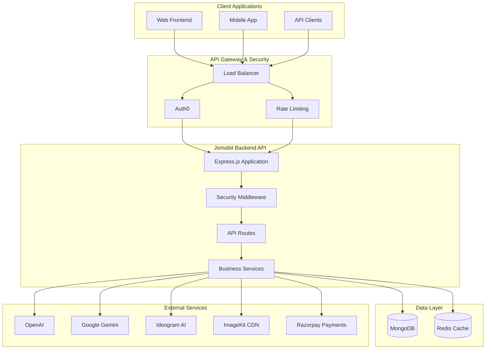

# Jomobit Backend API Documentation

Welcome to the comprehensive documentation for the Jomobit Backend API - an AI-powered poster generation platform that helps businesses create professional marketing materials.

## 📚 Documentation Structure

This documentation is organized into chapters for easy navigation and understanding:

### Core Documentation
- **[Chapter 1: Overview & Architecture](./01-overview-architecture.md)** - System overview, architecture, and technology stack
- **[Chapter 2: Getting Started](./02-getting-started.md)** - Setup, installation, and development environment
- **[Chapter 3: Authentication & Security](./03-authentication-security.md)** - Auth0 integration, security measures, and access control
- **[Chapter 4: Database Design](./04-database-design.md)** - MongoDB schemas, relationships, and data models
- **[Chapter 5: API Endpoints](./05-api-endpoints.md)** - Complete API reference with examples
- **[Chapter 6: AI Integration](./06-ai-integration.md)** - AI providers, generation workflow, and prompt engineering
- **[Chapter 7: Business Logic](./07-business-logic.md)** - Core services, credit system, and subscription management
- **[Chapter 8: Testing Strategy](./08-testing-strategy.md)** - Unit, integration, and E2E testing approaches
- **[Chapter 9: Deployment & Operations](./09-deployment-operations.md)** - Production deployment, monitoring, and maintenance
- **[Chapter 10: Troubleshooting](./10-troubleshooting.md)** - Common issues, debugging, and solutions

### Reference Materials
- **[API Reference](./reference/api-reference.md)** - Complete endpoint documentation
- **[Error Codes](./reference/error-codes.md)** - Error handling and status codes
- **[Environment Variables](./reference/environment-variables.md)** - Configuration reference
- **[Database Schema](./reference/database-schema.md)** - Complete schema documentation
- **[Database Indexes](./database-indexes.md)** - Index documentation and setup guide
- **[Database Indexes Reference](./database-indexes-reference.md)** - Quick reference for indexes
- **[Subscription Jobs](./subscription-jobs.md)** - Scheduled jobs for subscription management

## 🎯 What is Jomobit?

Jomobit is an AI-powered platform that enables businesses to generate professional posters and marketing materials. The backend API provides:

- **User Management**: Auth0-based authentication and user profiles
- **Business Profiles**: Multi-profile support for different businesses
- **Template System**: Curated poster templates with filtering and search
- **AI Generation**: Integration with multiple AI providers (OpenAI, Gemini, Ideogram)
- **Credit System**: Usage-based billing and subscription management
- **Admin Dashboard**: Administrative tools and analytics

## 🏗️ High-Level Architecture

## 🚀 Quick Start

1. **Prerequisites**: Node.js 18+, MongoDB, Redis
2. **Installation**: `npm install`
3. **Configuration**: Copy `.env.example` to `.env` and configure
4. **Database**: Start MongoDB and Redis
5. **Run**: `npm run dev`

For detailed setup instructions, see [Chapter 2: Getting Started](./02-getting-started.md).

## 🔑 Key Features

### User Stories Supported

**As a Business Owner:**
- I want to create multiple business profiles for different ventures
- I want to generate professional posters using AI
- I want to customize templates with my brand colors and content
- I want to track my usage and manage my subscription

**As a Developer:**
- I want comprehensive API documentation
- I want secure authentication and authorization
- I want reliable error handling and monitoring
- I want scalable architecture for growth

**As an Administrator:**
- I want to manage users and their permissions
- I want to monitor system health and usage
- I want to manage templates and content
- I want to handle billing and subscriptions

## 📊 Technology Stack

- **Runtime**: Node.js 18+
- **Framework**: Express.js 5.x
- **Database**: MongoDB with Mongoose ODM
- **Cache**: Redis
- **Authentication**: Auth0 with JWT
- **AI Providers**: OpenAI, Google Gemini, Ideogram
- **File Storage**: ImageKit CDN
- **Payments**: Razorpay
- **Testing**: Jest with Supertest
- **Security**: Helmet, CORS, Rate Limiting
- **Monitoring**: Winston Logging

## 📈 Performance & Scale

- **Rate Limiting**: Tiered limits based on endpoint type
- **Caching**: Redis for session and frequently accessed data
- **Database**: Optimized indexes and aggregation pipelines
- **CDN**: ImageKit for image delivery and optimization
- **Monitoring**: Comprehensive logging and error tracking

## 🔒 Security Features

- **Authentication**: Auth0 JWT validation
- **Authorization**: Role-based access control (RBAC)
- **Input Validation**: Joi schemas and sanitization
- **Rate Limiting**: Multiple tiers for different endpoints
- **Security Headers**: Helmet.js configuration
- **CORS**: Configurable origin validation
- **Webhook Security**: Signature validation for all webhooks

## 📞 Support & Contributing

For questions, issues, or contributions:
- Review the troubleshooting guide in [Chapter 10](./10-troubleshooting.md)
- Check the API reference for endpoint details
- Follow the testing guidelines in [Chapter 8](./08-testing-strategy.md)

---

*This documentation is maintained alongside the codebase and updated with each release.*